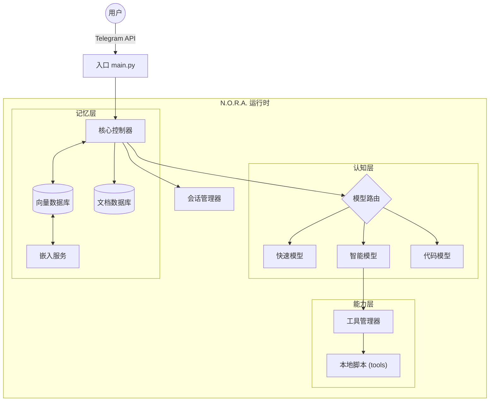

# N.O.R.A. Core - 技术设计文档 (TDD)

> **项目名称:** N.O.R.A. Core (Project Echo)  
> **版本:** 1.1.2-CN (Syntax Fix v2)  
> **维护者:** CaptainCN (WR), Nora  
> **仓库地址:** https://github.com/captain-wangrun-cn/N.O.R.A.Core  

---

## 1. 摘要 (Executive Summary)

N.O.R.A. Core 旨在构建一个模块化、高可扩展的 AI 代理系统。
本项目强调 **配置驱动** 和 **接口抽象**，确保底层模型（LLM）和存储后端（Database）可以灵活替换，而不影响核心业务逻辑。

---

## 2. 系统架构 (System Architecture)

### 2.1 抽象架构图



### 2.2 核心组件规范

#### 2.2.1 核心层 (`core/`)
- **`main.py`**: 仅作为程序入口。负责初始化配置、建立数据库连接、启动 Bot 轮询 (`Application.run_polling`)。
- **`controller.py`**: 业务逻辑中枢。负责协调记忆检索、Prompt 构建、模型调用和工具执行的流水线。
- **`session.py`**: 管理用户上下文。处理消息队列、滑动窗口截断、用户状态机。

#### 2.2.2 认知层 (`brain/`)
- **`llm_interface.py`**: 定义抽象基类 `BaseLLM`。
- **`providers/`**: 具体实现 (如 `GeminiProvider`, `OpenAIProvider`)。
- **`router.py`**: 根据意图（Intent）将请求分发给 `FastLLM` 或 `SmartLLM`。具体使用的是哪个模型，由 `config.py` 决定。

#### 2.2.3 记忆层 (`memory/`)
- **`vector_store.py`**: 向量数据库接口。支持 Qdrant/Chroma/Pinecone 等后端。
- **`rag_engine.py`**: 封装“检索-生成”逻辑。负责将 Embedding 结果转化为 Prompt 上下文。

#### 2.2.4 能力层 (`tools/`)
- **`manager.py`**: 负责扫描 `tools/` 目录，动态加载 Python 模块，并将其注册为 LLM 可调用的工具。

---

## 3. 实施路线图 (Roadmap)

### 第一阶段: 基础架构 (Phase 1: Foundation)
- [x] **Git 初始化**。
- [ ] **核心拆分:** 建立 `core/` 目录，将逻辑从 `main.py` 剥离。
- [ ] **LLM 抽象:** 编写 `BaseLLM` 接口，并实现第一个 Provider (Gemini)。
- [ ] **Ping 测试:** 实现最简单的 `/start` 响应。

### 第二阶段: 记忆接入 (Phase 2: Memory)
- [ ] **Docker 环境:** 编写 `docker-compose.yml` 启动数据库。
- [ ] **RAG 流程:** 打通 Embedding -> VectorDB -> Prompt 的链路。

### 第三阶段: 动态能力 (Phase 3: Evolution)
- [ ] **工具热加载:** 实现不重启服务即可加载新 `.py` 工具的机制。

---

## 4. 目录结构规范

```text
nora-core/
├── main.py                 # 启动入口
├── config.py               # 全局配置
├── docker-compose.yml      # 容器编排
├── requirements.txt        # Python 依赖
├── .env                    # 密钥
├── core/                   # 核心业务
│   ├── __init__.py
│   ├── controller.py       # 流程控制
│   └── session.py          # 会话状态
├── brain/                  # 大脑 (LLM)
│   ├── __init__.py
│   ├── interface.py        # 抽象接口
│   ├── router.py           # 路由逻辑
│   └── providers/          # 具体实现 (gemini.py, openai.py)
├── memory/                 # 记忆
│   ├── __init__.py
│   ├── vector_store.py     # 向量库接口
│   └── rag.py              # RAG 逻辑
└── tools/                  # 工具箱
    ├── __init__.py
    ├── manager.py          # 工具加载器
    └── scripts/            # 具体的工具脚本
```

---

*文档状态: 正式版 v1.1.2*
