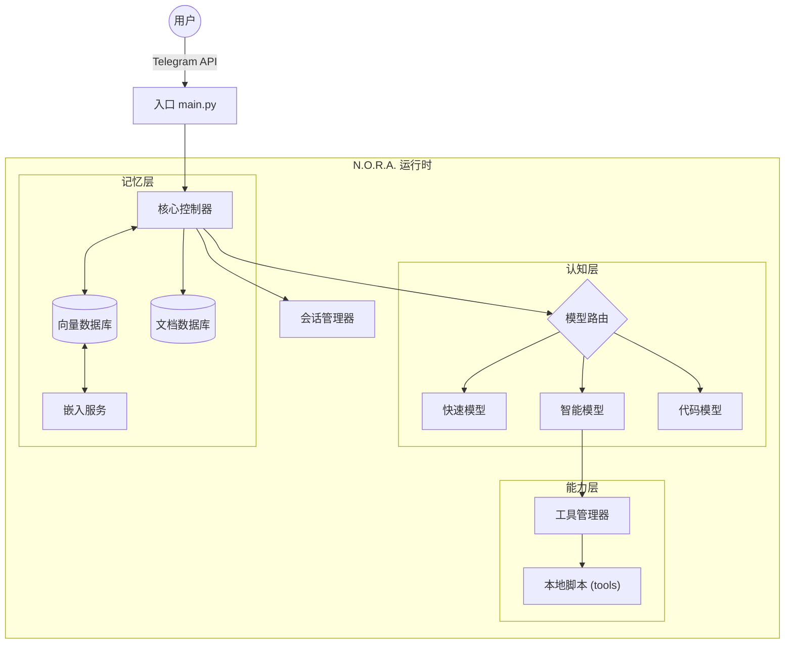

# N.O.R.A. Core - 技术设计文档 (TDD)

> **项目名称:** N.O.R.A. Core (Project Echo)  
> **版本:** 1.2.0-CN (Interaction Model)  
> **维护者:** CaptainCN (WR), Nora  
> **仓库地址:** https://github.com/captain-wangrun-cn/N.O.R.A.Core  

---

## 1. 摘要 (Executive Summary)

N.O.R.A. Core 旨在构建一个模块化、高可扩展的 AI 代理系统。
本项目强调 **配置驱动** 和 **接口抽象**，确保底层模型（LLM）和存储后端（Database）可以灵活替换，而不影响核心业务逻辑。

---

## 2. 系统架构 (System Architecture)

### 2.1 抽象架构图
*... (图表部分保持不变) ...*

### 2.2 核心组件规范
*... (组件规范部分保持不变) ...*

### 2.3 用户交互模型 (Interaction Model) - **[核心更新]**

本系统采用 **“聚合输入、内部流式、原子输出”** 的高级交互模型，旨在兼顾用户体验、响应性和成本效益。

#### 2.3.1 消息聚合器 (`platforms/aggregator.py`)
- **目的:** 解决用户连续发送多条消息时，系统过早响应导致对话碎片化的问题。
- **机制:**
  1.  **启动计时器:** 当收到用户的第一条消息后，启动一个可配置的**缓冲计时器** (默认 `BUFFER_TIMEOUT: 3.0` 秒，范围建议 2-4 秒)。
  2.  **合并消息:** 在计时器结束前收到的所有新消息，都会被追加到会话缓冲区中，并重置计时器。
  3.  **触发处理:** 只有当计时器正常结束，聚合器才会将合并后的完整消息，作为一个单一事件，发送给核心控制器。

#### 2.3.2 内部流式抢占 (`core/controller.py`)
- **原则:** 对用户，响应是**一次性**的；对内部，生成是**流式的**。
- **机制:**
  1.  **启动生成:** 控制器收到聚合消息后，立刻调用 `adapter.start_typing()`，并创建一个 `asyncio.Task` 来执行 LLM 的**流式生成**。
  2.  **内存缓冲:** 在内存中将流式返回的文本块拼接成一个完整的回复。
  3.  **抢占逻辑 (Preemption):** 如果在生成过程中，聚合器发来了**新的用户输入**：
      a.  **取消 (Cancel)** 正在进行的 LLM `Task`。
      b.  **抢救 (Salvage)** 已经生成了一半的文本作为“被打断的思路”。
      c.  **重构 (Reconstruct)** 一个包含“旧输入+旧思路+新输入”的全新上下文。
      d.  **重启 (Restart)** 生成流程。
  4.  **原子输出 (Atomic Output):** 仅在流式生成**自然完成**后，才调用 `adapter.send_message()` 将完整回复一次性发送。

---
## 3. 实施路线图 (Roadmap)
*... (路线图部分保持不变) ...*
---
## 4. 目录结构规范
*... (目录结构部分保持不变) ...*
---
*文档状态: 正式版 v1.2.0*
