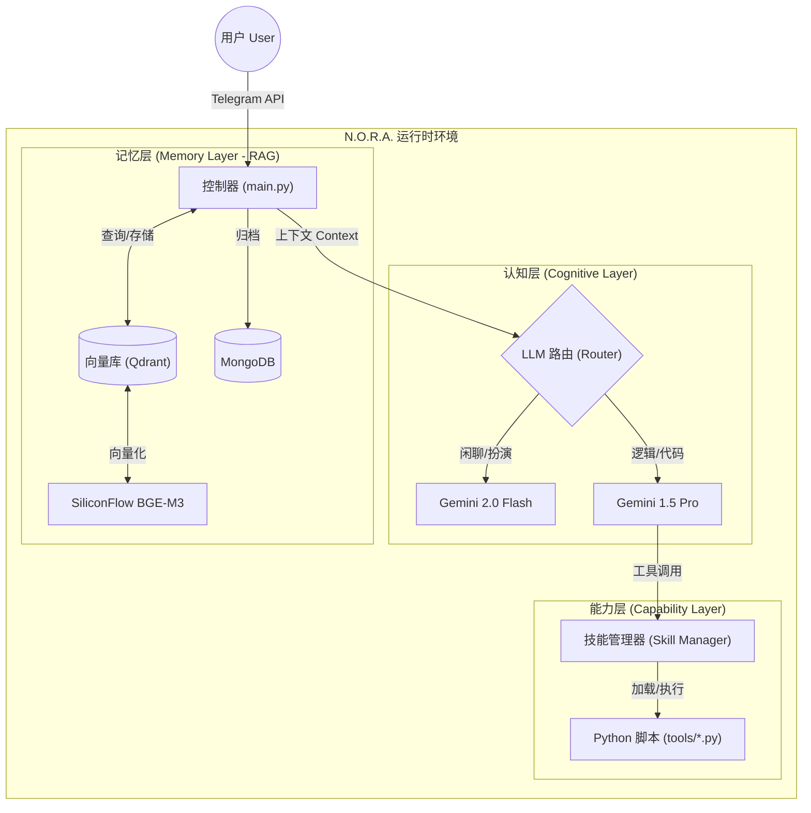

# N.O.R.A. Core - 技术设计文档 (TDD)

> **项目名称:** N.O.R.A. Core (Project Echo)  
> **版本:** 1.0.1-CN  
> **维护者:** CaptainCN (WR), Nora  
> **仓库地址:** https://github.com/captain-wangrun-cn/N.O.R.A.Core  

---

## 1. 摘要 (Executive Summary)

N.O.R.A. Core (Neural Optimized Responsive Assistant) 是一个定制化、轻量级的 AI 代理框架，旨在替代通用的 OpenClaw 系统。其核心设计目标是实现 **成本效益最大化**、**长期记忆留存 (RAG)** 以及 **自主能力扩展 (热重载技能)**。

系统采用 **Python 优先** 的架构，利用 **Docker** 保证基础设施的一致性，并使用 **Git** 进行版本控制。

---

## 2. 系统架构 (System Architecture)

### 2.1 高层组件图 (High-Level Component Diagram)



### 2.2 核心组件规范

#### 2.2.1 控制器 (Controller - `main.py`)
- **职责:** 事件循环处理、消息路由、错误管理。
- **库:** `python-telegram-bot` (异步模式)。
- **逻辑流:**
  1. 接收来自 Telegram 的 `Update`。
  2. 从 `记忆层` 检索用户上下文 (L1 短期 + L2 长期)。
  3. 构建 `System Prompt` (包含身份设定 + 技能描述)。
  4. 调用 `认知层` (LLM)。
  5. 执行 `能力层` (如果模型请求调用工具)。
  6. 返回响应给用户。

#### 2.2.2 认知层 (Cognitive Layer - `brain/`)
- **LLM 客户端:** 统一封装兼容 OpenAI 格式的 API (Gemini/DeepSeek/SiliconFlow)。
- **路由逻辑 (Router):**
  - **启发式规则:** 如果消息包含代码块或关键词 (`写`, `脚本`, `分析`) -> **Pro 模型**。
  - **默认:** -> **Flash 模型** (省钱/快速)。
- **提示工程 (Prompt Engineering):**
  - 上下文窗口管理 (滑动窗口: 最近 10 条)。
  - RAG 上下文注入 (Top-k 相关记忆)。

#### 2.2.3 记忆层 (Memory Layer - `memory/`)
- **向量数据库:** **Qdrant** (本地 Docker 实例)。
- **Embedding 模型:** **BGE-M3** (通过 SiliconFlow API 调用，或本地 fallback)。
- **数据结构 (Qdrant Point):**
  ```json
  {
    "id": "uuid",
    "vector": [0.12, ...],
    "payload": {
      "text": "用户喜欢体素游戏。",
      "timestamp": "2026-02-06T06:00:00Z",
      "tags": ["偏好", "游戏"],
      "type": "chat_history"
    }
  }
  ```

#### 2.2.4 能力层 (Capability Layer - `tools/`)
- **设计模式:** 动态模块加载 (`importlib`)。
- **发现机制:** 监控进程监听 `tools/*.py` 变化。
- **定义规范:** 每个工具模块必须导出一个 `TOOL_DEF` 字典和一个 `run(**kwargs)` 函数。
- **安全性:** (V1版本可选) 代码执行的子进程隔离。

---

## 3. 实施路线图 (Roadmap)

### 第一阶段: 基础建设 (Phase 1: Foundation) - 进行中
*目标: 建立连接并实现基本聊天功能。*
- [x] **仓库初始化:** Git 结构和环境配置。
- [ ] **LLM 集成:** 使用 `openai` SDK 实现 `brain/llm.py` (对接 Gemini 接口)。
- [ ] **Telegram 挂钩:** 连接 `main.py` 实现基本回声逻辑。
- [ ] **身份注入:** 实现 `SOUL` (人设) 的加载。

### 第二阶段: 记忆植入 (Phase 2: Memory Integration)
*目标: 实现跨会话的持久化记忆。*
- [ ] **基础设施:** 编写 `docker-compose.yml` (Qdrant & MongoDB)。
- [ ] **RAG 管道:** 实现 `memory.add(text)` 和 `memory.query(text)`。
- [ ] **上下文注入:** 修改控制器，在调用 LLM 前先拉取相关记忆。

### 第三阶段: 自主进化 (Phase 3: Autonomous Expansion)
*目标: 启用自我编程能力。*
- [ ] **工具管理器:** 在 `tools/manager.py` 中实现热重载逻辑。
- [ ] **元工具 (Meta-Tools):** 创建 `write_tool.py`，允许 AI 在 `tools/` 中生成新 Python 脚本。

---

## 4. 开发规范 (Development Standards)

### 4.1 代码风格
- **语言:** Python 3.10+
- **格式化:** PEP 8 (使用 `black` 格式化)。
- **类型提示:** 所有函数签名必须包含严格的 Type Hints (`typing.List`, `typing.Optional`)。
- **异步:** 所有 I/O 操作 (数据库, API, 网络) 必须使用 `asyncio`。

### 4.2 配置管理
- **密钥:** 所有 API Key 必须通过 `python-dotenv` 从 `.env` 加载。
- **常量:** 非机密配置 (超时时间, 模型名称) 存放在 `config.py`。

### 4.3 目录结构
```text
nora-core/
├── main.py                 # 应用入口
├── config.py               # 全局配置
├── docker-compose.yml      # 基础设施定义
├── requirements.txt        # Python 依赖
├── .env                    # 密钥 (严禁提交到 Git)
├── brain/
│   ├── __init__.py
│   ├── llm.py              # LLM 客户端适配器
│   ├── prompts.py          # 系统提示词模板
│   └── router.py           # 模型路由逻辑
├── memory/
│   ├── __init__.py
│   ├── vector.py           # Qdrant 包装器
│   └── mongo.py            # MongoDB 包装器
└── tools/
    ├── __init__.py
    ├── manager.py          # 工具加载/执行器
    └── base_tools.py       # 内置工具 (如: 搜索)
```

---

*文档状态: 草稿 / 活跃*  
*最后更新: 2026-02-06*
