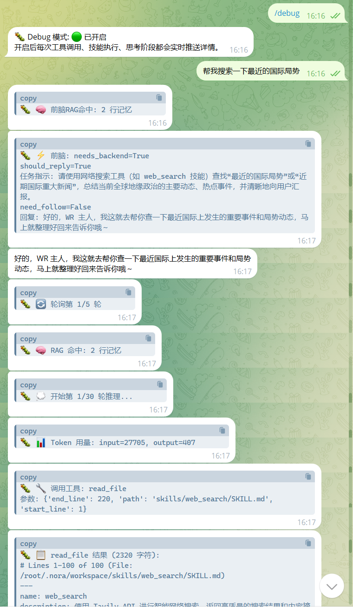

# NORA 使用指南（实战版）

> 面向 N.O.R.A.Core 的日常使用者：教你如何更高效地使用。

---
# P1 面向大部分日常使用者

## 指令表

你可以直接复制给Telegram的BotFather
```
start - 开始对话
clear - 清空聊天记录
status - 查看状态
stop - 停止所有任务
undo - 撤销上一条消息
model - 选择模型
nora_prefs - 修改nora偏好
reload_models - 热应用选定模型
regenerate_proactive - 覆盖重建日程系统
schedule_today - 查看今日日程计划
custom_scope - 选择自定义提示词的注入范围
debug - ⚠️调试用 切换调试
debug_cleanup - ⚠️调试用 清理选项
set_stream - ⚠️调试用 切换流式请求
```

## 1. 如何更好的工作(了解基本的前后脑架构)
NORA使用前后脑架构，前脑负责对话，后脑负责工作
你让NORA去干活时，他会交给后脑，前脑负责跟你对话以及审查工作

所以，你可以询问NORA工作进度，让他停止，新增任务等
直接跟他说即可


## 2. 如何更好的适合你(把他当作你的贴身助手，而不是纯纯的工具)
NORA会在`SOUL.md`,`USER.md`,`SCHEDULE.md`等文件内，记录关于你的内容(有关各个文件的作用可以查看[文件总览](architecture/identity_files.md#%E6%96%87%E4%BB%B6%E6%80%BB%E8%A7%88))

所以，如果想要NORA能更好的符合你，那么请你改变你的看法，将你的喜好、作息、习惯等告诉他。他会记录下来

## 3. 选择合适,稳定的模型
不可以贪图便宜，也不要盲目选择。你需要选择的是正确的合适的模型

NORA目前需要`4`个模型
- `fast`模型: 快速决策,判断是否追问,web_fetch总结等
请使用轻量小模型。本人推荐如`gemini-2.5-flash-lite`这样的轻量模型
- `smart`模型: 平常对话,前脑主模型
你可以选择rp(roleplay)效果好，较为聪明的模型。我个人使用的是`gemini-3-flash-preview`模型
- `image`模型：顾名思义，用于图像理解
请使用较强的多模态模型，需要生成关键词标签和提取图中文本。我个人使用的是`gemini-3.1-pro-preview`
- `coder`模型: 专业决策,调用工具/技能,后脑主模型
涉及到工具调用，代码编写等操作，请使用代码模型，如`codex`,`claude`系列等。我个人使用的是`gpt-5.1-codex-max`
- `summary`模型: 总结,压缩等
无特定要求，尽量选择轻量智能，文字处理好的模型。我个人使用`grok-4.1`

**无论是哪个模型，都请选择聪明，可靠的模型。低智商的模型对决策和安全性都有很大的风险**

**NORA的使用过程中会有很多次请求，除了选择性价比高的模型以节约成本外，还需要选择稳定的API**

## 4.NORA的追问(关于在线状态/消息段/上下文)
NORA使用上下文压缩和在线状态都基于消息段

当你在和NORA对话时，NORA状态为`完全在线(ONLINE)`
当你和NORA聊着聊着，你不说话了，那么NORA大概率会追问，关心你。如同你和你的好朋友在畅快聊天时突然不说话
如果他追问之后还是没有动静，那么NORA会和你告别，此时就会进入`半在线(SEMI_ONLINE)`状态
此时，你们的此轮对话就算一个消息段

>[!IMPORTANT]
>判断是否要追问，告别等，完全由AI自主生成决定
>也就是说理论上你可以直接跟他告别，说你在忙，他就不会追问你

## 5.图片回顾
你给NORA发送的每一张图片，都会生成标签，提取文本，计入数据库
那么，后续你和他对话时，你可以像和你的朋友一样问他之前发过的图片，比如：`我昨天给你发的那一张，我拍的天空，你还存着吗？`，NORA就会根据关键词去搜索数据库，并把图片重新拿出来看，拿出来理解

---

# 面向专业/深度使用者

## 1. 如何判断是否真的工作(善用debug模式)
`/debug`指令可以开关debug调试模式，在debug模式下，所有的操作都会发送，便于查看和分析Nora进行了什么操作

但是debug模式，顾名思义，也会输出调试内容，可能会导致发送的消息过于繁琐。所以请根据需要开启

## 2. 根据需要定时查看markdown文件
如上方P1中的第2点。你可以根据需要定时查看这些markdown文件，以免NORA记录了错误的信息或误导性内容

## 3. 安全性
有条件的，请把NORA放在例如`docker`等隔离环境，不要将高风险权限及内容交给NORA
**<font color="red">最重要的是，请选择聪明的模型，而不是为了贪图便宜，选择那些参数量可能都没有你头发丝多的模型</font>**

---

其他内容欢迎补充
