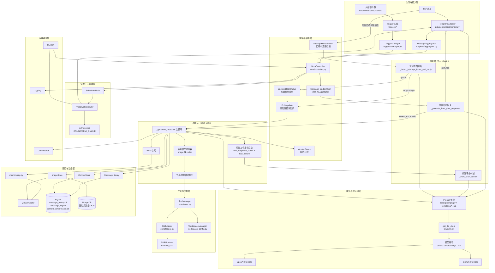

# N.O.R.A. Core 架构设计文档

> [!CAUTION]
> 受到openclaw的启发，几乎完全用ai做了这个项目，我想要一个既可以像真人一样陪我，又可以像个专业人士一样，自己学习，工作，帮我分担一点
>
> 所以我除了给他作为一个Agent智能体该有的东西之外，还改造了我需要的地方，比如主动消息，抢占机制，类似人类的消息发送与理解等等
>
> 该有的有，什么RAG，MEMORY，TOOLS，SKILLS。我想要的，也有
>
> 可能除了这个CAUTION部分是我写的，其他几乎全部都是ai写的
>
> ---
>
> 我不反对ai，我对ai保持乐观态度，我也用ai，我也喜欢ai
>
> 但是我歧视某些人，那些过于依赖ai来写代码，自己什么也不懂，甚至没写过代码，完完全全交给ai来做。你问他原理？不知道；你问他架构？不知道；你问他设计？不知道；
>
> 不要误解我，我不是指小白，我觉得小白使用ai来学习，制作一些小东西，拿成品去炫耀分享，获得成就感：我没意见、我赞成、我还会帮。比如我还教了我的朋友怎么提需求，用什么ai，我认为这是好事
>
> 自己什么也不懂，唯一的自主想法只是想要实现什么东西，想要光靠ai实现一些复杂的东西，做出来了还拿源码到处炫耀扔屎：对不起我很歧视你，没有主观思想，全身上下动了的只有眼睛和嘴，我认为的ai不是这样的
>
> ---
>
> AI，Artificial Intelligence。我很喜欢一本书《仿生人会梦见电子羊吗》（DO ANDROIDS DREAM OF ELECTRIC SHEEP ?）。当ai真的成为了完完全全的独立智能体，是危机还是机遇？
>
> 如果未来真的爆发某种AI危机，仿生人危机，我认为一定是人类的错。是人类赋予了AI实体，一个没有实体的东西会造成什么大灾难吗？顶多只是误导人类罢了，那也是人类的判断错误
>
> 对不起跑偏了 :(
>
> ---
>
> 这个项目很大概率完全不符合各类行业标准，行业规范。因为我基本没有认真阅读各类材料，标准等等。但是我不管，这是我的个人项目，我自己用，我觉得合适，that's all
>
> ---
>
> 我喜欢说这些话，假装自己很有感悟很有哲理很了解，可能实际上只是胡乱说一通的自大
>
> 如果你觉得说的不对，没道理，有错误之类的，请不要管，当作我的自娱自乐自言自语，这是我的个人项目
>
> ---
>
> 行了就这样吧

> **项目背景**  
> 本项目是一个纯个人娱乐项目，初衷是想要一个能像真人一样的对话对象，而不是单纯"问一句答一句"的人工智能。所有思路和设计由作者提供并指导，99% 的代码由 AI 协助完成。看不顺眼也请受着 :)

## 完整架构图

> 说明：这是“系统总览图”。各子系统细节请继续阅读下方索引文档（双脑、工具、技能、记忆、调度、触发器）。

## 文档索引

### 🧠 核心与交互 (Core Interactions)

- **[双进程架构 (Dual-Process Architecture)](./dual-process-architecture.md)**
  - _Current State_: 实现了"脑口分离"，前端负责快响应/打断，后端负责深度思考。
- **[消息抢占机制 (Preemption)](./preemption.md)**
  - _Legacy Context_: 早期打断逻辑的设计思路，现已整合进双进程架构中。
- **[时间戳插入机制 (Timestamp Insertion)](./timestamp-insertion.md)**
  - 统一消息时间戳注入策略与上下文时间语义。

### 🧩 技能与执行 (Skills & Execution)

- **[技能系统 (Skills)](./skills.md)**
  - 为什么我们需要让 AI "做事" 而不仅仅是聊天。
- **[技能系统实现细节 (Skill System)](./skill-system.md)**
  - 技能加载、执行协议与目录约定（`SKILL.md` + `main.py`）。
- **[技能增强 (Skill Enhancement)](./skill-enhancement.md)**
  - 优化技能的发现与创建流程，避免低效的文件系统遍历。
- **[动态技能机制 (Dynamic Skills)](./dynamic-skills.md)**
  - 运行期创建/更新技能能力的设计。
- **[工作区隔离 (Workspace Isolation)](./workspace.md)**
  - 限制 AI 的文件访问权限，防止误操作系统关键文件。
- **[内置工具系统 (Tools)](./tools.md)**
  - `ToolManager` 全部内置工具的参数、返回格式、安全限制与扩展约定。

### 💾 记忆与上下文 (Memory & Context)

- **[消息历史管理 (Message History)](./message_history.md)**
  - 四层存储策略 (Raw, Compressed, Vector, Archive) + 对话分段 (Conversation Session Segmentation)。
- **[对话分段系统 (Conversation Segmentation)](./conversation-segmentation.md)**
  - ONLINE → SEMI_ONLINE 时封闭对话段落，生成段落摘要，分段插入上下文，配合前后脑轮询闭环。
- **[消息压缩 (Message Compression)](./message-compression.md)**
  - 针对长对话的 Token 优化策略。
- **[图片记忆系统 (Image Memory)](./image-memory.md)**
  - 图片 ID 分配、LLM 标签提取、MongoDB + Qdrant 双写、语义检索与 `view_image` 工具。
- **[身份与记忆文件一览](./identity_files.md)**
  - SOUL/USER/MEMORY/SCHEDULE/CUSTOM/SECRET 文件的角色、边界、专用工具与 openclaw 启发说明。

### 🛡️ 监控与运维 (Ops & Monitoring)

- **[主动消息调度 (Proactive Scheduler)](./schedule-system.md)**
  - 每日主动消息计划生成、动态闹钟、在线状态管理。
- **[外部触发系统 (Trigger System)](./trigger-system.md)**
  - 非 IM 渠道事件（如 Email）接入、模型过滤判定、通知链路复用。
- **[Trigger 开发指南 (Trigger Development Guide)](./trigger-development.md)**
  - 如何实现、注册、调试一个自定义 Trigger（Email 为示例）。
- **[日志系统 (Logging)](./logging.md)**
  - 结构化日志设计，区分用户可见与调试信息。
- **[工具循环控制 (Tool Loop Detection)](./tool-loop.md)**
  - 防止 AI 陷入死循环的保护机制。
- **CLI 清理策略更新（RAG 数据）**
  - `clean_qdrant` / `clean_mongodb` 已改为清空所有 collections，并加入强警告与二次确认（`DELETE ALL`）。

## 核心理念

**像真人一样对话**，意味着：

1. **即时打断** - 真人聊天时可以随时插话，AI 也应该能立即响应新消息
2. **连续记忆** - 真人记得之前说了什么，AI 也应该保持上下文连贯
3. **主动思考** - 真人会调用工具、查资料、写代码，AI 也应该能自主完成多步骤任务
4. **知错就改** - 真人会从错误中学习，AI 也应该通过反馈优化行为

## 设计原则

1. **实时性优先** - 用户输入应立即中断当前任务
2. **安全第一** - 工具执行、文件访问、命令执行都有严格限制
3. **LLM 友好** - 提示设计、错误反馈、循环检测都针对 LLM 行为优化
4. **可观测性** - 分级日志、状态追踪、调试友好
5. **模块化** - 平台适配器、LLM 提供者、技能系统都可独立扩展
