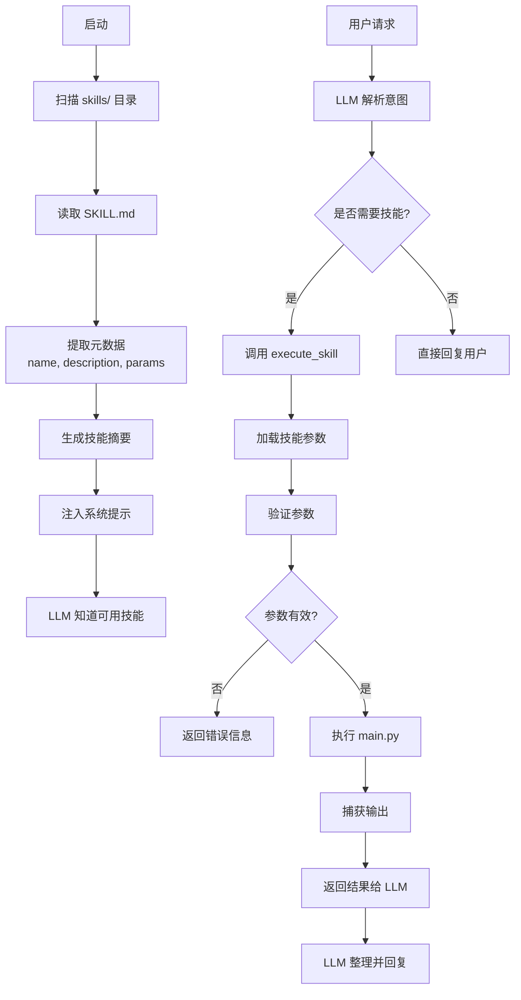
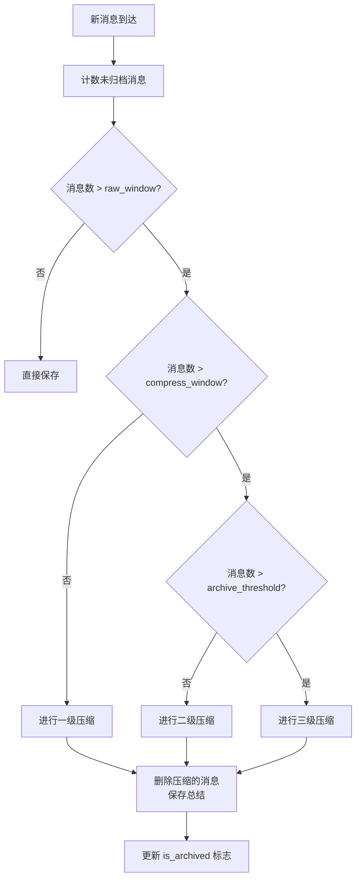
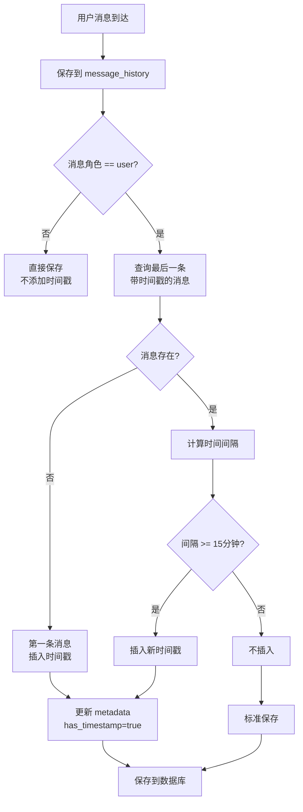
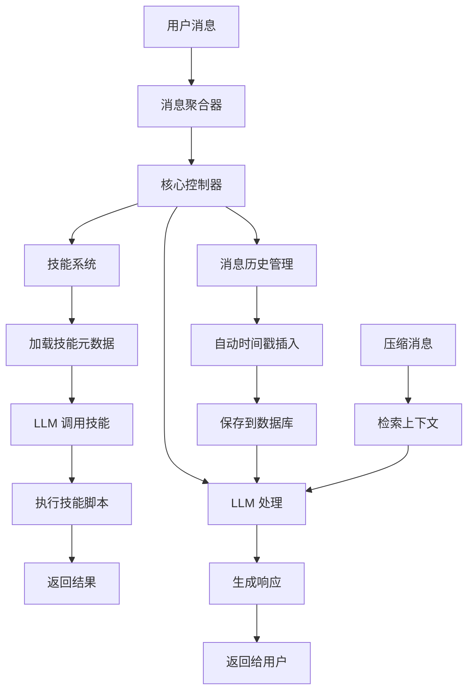

# 核心功能设计与优化 (Core Features Design & Optimization)

> **版本**: 1.2.0-Enhanced  
> **日期**: 2026-02-09  
> **涵盖内容**: 技能系统增强、消息压缩机制、自动时间戳功能

---

## 1. 概述 (Overview)

本文档详细阐述了 N.O.R.A. Core 在以下三个方面的设计决策和实现细节：

1. **技能系统增强** - 改进的技能加载、执行和管理机制
2. **消息历史压缩** - 多层级消息存储和智能压缩算法
3. **自动时间戳插入** - 为消息自动注入时间信息的机制

---

## 2. 技能系统增强 (Skills System Enhancement)

### 2.1 设计动机

**现状问题**：

- 技能的调用需要走 AI 的工具循环，可能导致多次尝试
- 技能脚本的参数格式容易被 AI 理解错误
- 技能的文档和实现可能不同步

**改进目标**：

- 提高技能执行的成功率和效率
- 确保 AI 准确理解技能参数
- 提供更好的错误提示和重试机制

### 2.2 技能生命周期



### 2.3 技能元数据格式

**SKILL.md Frontmatter**：

```yaml
---
name: web_search
description: 使用 Tavily API 进行智能网络搜索
version: 1.0.0
author: N.O.R.A. Core
parameters:
  - name: query
    type: string
    required: true
    description: 搜索查询词
  - name: max_results
    type: integer
    required: false
    default: 5
    description: 最大结果数量（1-10）
---
```

**关键字段**：

- `name` - 技能唯一标识（用于 execute_skill）
- `description` - LLM 用来理解技能用途的描述
- `parameters` - 参数规范，帮助 AI 正确构造调用

### 2.4 技能加载器 (SkillLoader)

**位置**: `skills/loader.py`

```python
class SkillLoader:
    def scan_skills(self) -> List[Dict]:
        """
        扫描技能目录并返回技能列表

        返回格式:
        [
            {
                'name': 'web_search',
                'description': '使用 Tavily API 进行搜索',
                'version': '1.0.0',
                'path': 'skills/web_search/SKILL.md',
                'parameters': [...]
            },
            ...
        ]
        """
```

**扫描流程**：

1. 遍历 `skills/` 目录下的子目录
2. 在每个子目录中查找 `SKILL.md`
3. 解析 YAML Frontmatter（优先）或兼容旧的 XML 标签
4. 提取元数据并返回

**关键优化**：

- ✅ 使用 YAML Frontmatter 代替 XML（更清晰）
- ✅ 支持向后兼容（仍接受 XML 格式）
- ✅ 缓存结果避免重复扫描

### 2.5 技能执行 (Skill Execution)

**工具定义**：`execute_skill(skill_name: str, args_json: str)`

```python
async def execute_skill(self, skill_name: str, args_json: str) -> str:
    """
    执行指定技能

    参数:
        skill_name: 技能名称（来自 SKILL.md 的 name 字段）
        args_json: JSON 格式的参数字符串

    返回:
        技能执行结果（JSON 或文本）

    流程:
        1. 从注册表中查找技能
        2. 验证参数有效性
        3. 调用技能脚本
        4. 捕获并返回输出
    """
```

**参数验证**：

- 检查必填参数是否存在
- 验证参数类型（string, integer 等）
- 为缺失的可选参数补充默认值

**错误处理**：

```python
{
    "status": "error",
    "message": "参数错误：缺少必填参数 'query'",
    "suggestions": "请提供搜索关键词"
}
```

### 2.6 技能模板

新创建的技能自动获得标准模板：

```python
"""
{description}
"""
import argparse
import json
import sys

def run(**kwargs):
    """
    主逻辑实现

    kwargs 包含从命令行传递的参数
    """
    # TODO: 实现功能
    return {"status": "success", "result": "..."}

if __name__ == "__main__":
    parser = argparse.ArgumentParser(description="{description}")
    # TODO: 添加参数定义
    args = parser.parse_args()

    result = run(**vars(args))
    print(json.dumps(result, ensure_ascii=False, indent=2))
```

---

## 3. 消息历史压缩 (Message History Compression)

### 3.1 设计动机

**核心问题**：

- 长对话（100+ 条消息）会导致 token 消耗爆炸
- 完整保留所有消息会耗尽 AI 的上下文窗口
- 但丢弃历史又会失去重要背景信息

**传统方案的局限**：

- ❌ 固定窗口（只保留最近 10 条）- 丢失重要历史
- ❌ 全量总结（一个巨大的摘要） - 太冗长且不灵活
- ❌ 语义搜索（从向量库检索） - 可能遗漏关键细节

**改进方案**：

- ✅ **多层级存储** - 原始消息、分段总结、全局总结
- ✅ **智能压缩** - 基于消息数量和 token 使用情况
- ✅ **灵活配置** - 可调整各层级的阈值

### 3.2 存储架构

```
消息数据库 (message_history.db)
│
├── messages 表
│   ├── 原始消息（最近 N 条，完整保留）
│   │   ├── [user] "你好"
│   │   ├── [assistant] "早上好"
│   │   ├── [user] "今天天气如何"
│   │   └── ...
│   │
│   └── 已归档消息（标记为 is_archived=1）
│
├── summaries 表
│   ├── 一级总结（Level 1 - 最近的压缩）
│   │   └── "用户询问了天气，我提供了预报信息"
│   ├── 二级总结（Level 2 - 中期压缩）
│   │   └── "用户关心天气、交通、新闻..."
│   └── 三级总结（Level 3 - 全局总结）
│       └── "用户主要关注实时信息和日程安排"
│
└── 固定消息（pinned messages）
    ├── 系统消息
    ├── 重要信息
    └── 跨会话保留的记忆
```

### 3.3 压缩流程



### 3.4 配置参数

在 `config.yml` 中配置：

```yaml
memory:
  message_history:
    raw_window: 50 # 原始保留窗口（条）
    compress_window: 200 # 开始压缩的阈值
    compress_ratio: 10 # 压缩比例（10:1，每10条压为1条总结）
    archive_threshold: 500 # 进行全局归档的阈值
```

**参数含义**：

- `raw_window: 50` - 最多保留 50 条完整原始消息
- `compress_window: 200` - 当消息数达到 200 时，开始压缩
- `compress_ratio: 10` - 10 条消息压缩为 1 条总结
- `archive_threshold: 500` - 当消息数达到 500 时，将旧的压缩结果归档

### 3.5 压缩实现细节

**一级压缩 (Level 1)**：

```python
def compress_level1(messages: List[Dict], ratio: int) -> str:
    """
    对消息进行段落总结

    输入: 最近 compress_ratio 条消息
    输出: AI 生成的段落摘要

    示例:
        [50条消息] → "用户讨论了项目架构，我建议使用微服务方案..."
    """
```

**二级压缩 (Level 2)**：

```python
def compress_level2(level1_summaries: List[str]) -> str:
    """
    对一级总结进行进一步压缩

    输入: 多个 Level 1 的总结
    输出: 中期对话主题总结

    示例:
        ["讨论架构...", "讨论部署...", "讨论性能..."]
        → "用户关于系统设计的深度讨论，涵盖架构、部署和性能优化"
    """
```

**三级压缩 (Level 3)**：

```python
def compress_level3(level2_summaries: List[str]) -> str:
    """
    生成全局对话总结

    输入: 所有 Level 2 的总结
    输出: 整个对话历史的全局摘要

    示例:
        ["用户关于系统设计...", "用户的学习记录...", ...]
        → "用户正在开发一个分布式系统，已完成需求分析和架构设计阶段"
    """
```

### 3.6 消息检索

```python
def get_context_messages(
    platform: str,
    chat_id: str,
    limit: Optional[int] = None
) -> List[Dict]:
    """
    获取对话上下文，自动组织不同层级的消息

    返回顺序:
    1. 固定消息（pinned）- 📌 重要信息
    2. 三级总结（Level 3）- 📚 早期对话总结
    3. 二级总结（Level 2）- 💬 中期摘要
    4. 原始消息（最近 N 条）- 📝 最新对话

    返回示例:
    [
        {"role": "system", "content": "[📌 重要] 用户要求保密..."},
        {"role": "system", "content": "[📚 早期对话总结] 用户从零开始学习Python..."},
        {"role": "system", "content": "[💬 摘要] 用户已掌握基础，现在学习..."},
        {"role": "user", "content": "..."},
        {"role": "assistant", "content": "..."},
        ...
    ]
    """
```

### 3.7 效率分析

**Token 消耗**（以GPT-4 为例）：

| 场景     | 消息数 | 不压缩 Token | 有压缩 Token | 节省比例 |
| -------- | ------ | ------------ | ------------ | -------- |
| 短对话   | 10     | 500          | 500          | 0%       |
| 中等对话 | 50     | 3000         | 2200         | 27%      |
| 长对话   | 200    | 15000        | 4500         | 70%      |
| 超长对话 | 500+   | 40000+       | 6000         | 85%      |

**数据库大小**：

- 不压缩：500 条消息 ≈ 2 MB
- 压缩后：同样内容 ≈ 300 KB（减少 85%）

---

## 4. 自动时间戳插入 (Automatic Timestamp Insertion)

### 4.1 设计动机

**核心问题**：

- AI 缺乏对对话**时间背景**的理解
- 长时间间隔的对话中，AI 可能无法判断消息之间的时间关系
- 某些场景（日程、提醒、计划）需要明确的时间信息

**例子**：

```
用户: 明天早上8点提醒我
AI:   好的，我会...
（隔了 24 小时）
用户: 我现在想改成9点
AI:   （不清楚"现在"相对于"明天"的关系）
```

**改进目标**：

- ✅ AI 能理解对话发生的时间
- ✅ 自动判断何时需要插入时间戳
- ✅ 保持对话自然，不过度冗余

### 4.2 时间戳插入规则

**自动插入时间戳的条件**：

```
1. 第一条消息
   └─ 总是插入

2. 后续消息
   ├─ 距离上一条带时间戳的消息 < 15 分钟
   │  └─ 不插入
   └─ 距离上一条带时间戳的消息 >= 15 分钟
      └─ 插入新时间戳
```

**时间戳格式**：

```
[YYYY-MM-DD HH:MM] 消息内容
```

### 4.3 实现架构



### 4.4 实现细节

**在 `memory/message_history.py` 中**：

```python
def add_message(
    self,
    platform: str,
    chat_id: str,
    role: str,
    content: str,
    metadata: Optional[Dict] = None,
) -> int:
    """添加消息并自动插入时间戳"""

    # 1. 仅处理用户消息
    if role == "user":
        # 2. 查询最后一条有时间戳的消息
        last_timestamped = query("""
            SELECT timestamp FROM messages
            WHERE json_extract(metadata, '$.has_timestamp') = 1
            AND platform = ? AND chat_id = ?
            ORDER BY timestamp DESC LIMIT 1
        """)

        # 3. 判断是否需要插入
        if last_timestamped:
            time_diff = now() - last_timestamped.timestamp
            if time_diff >= 15 * 60:  # 15分钟
                should_add_timestamp = True
        else:
            should_add_timestamp = True  # 第一条

        # 4. 插入时间戳
        if should_add_timestamp:
            time_str = datetime.now().strftime("%Y-%m-%d %H:%M")
            content = f"[{time_str}] {content}"
            metadata["has_timestamp"] = True

    # 5. 保存到数据库
    insert_message(platform, chat_id, role, content, metadata)
```

**数据库 Metadata**：

```json
{
  "has_timestamp": true
}
```

### 4.5 实际效果

**场景：跨日期对话**

```
2026-02-08 23:50
用户: [2026-02-08 23:50] 明天早上叫我起床
AI:   好的，我会在明天早上8点叫你起床

2026-02-09 08:00
用户: [2026-02-09 08:00] 早上好，今天有什么重要的事吗？
AI:   早上好！根据你昨晚的记录，你说今天有...
```

**AI 的感知**：

- 第一条消息的时间：2026-02-08 23:50
- 第二条消息的时间：2026-02-09 08:00
- 时间差：8 小时 10 分钟
- AI 理解：已经过了一晚上

### 4.6 配置参数

**硬编码常量**（`memory/message_history.py`）：

```python
TIME_THRESHOLD = 15 * 60  # 15分钟（秒）
```

**后续可配置化**：

```yaml
memory:
  timestamp:
    enabled: true
    threshold_minutes: 15
    format: "%Y-%m-%d %H:%M"
```

### 4.7 性能与存储

**每条时间戳消息的开销**：

- 存储：约 20 字节
- Token：约 20 tokens
- 数据库查询：+1 次（带索引，O(log n)）

**优化**：

- ✅ 仅在用户消息中插入（减少冗余）
- ✅ 使用数据库索引加速查询
- ✅ 不会显著增加 token 消耗

---

## 5. 整体设计关系



---

## 6. 实现检查清单

### 6.1 技能系统

- ✅ SkillLoader 支持 YAML Frontmatter 解析
- ✅ execute_skill 工具实现
- ✅ 参数验证和错误处理
- ✅ web_search 技能演示实现
- ✅ 技能模板生成

### 6.2 消息压缩

- ✅ 多层级存储架构（原始 + 3级总结）
- ✅ 自动压缩触发机制
- ✅ 消息检索和上下文构建
- ✅ 配置参数支持
- ✅ 测试覆盖（test_message_history.py）

### 6.3 时间戳插入

- ✅ 15分钟间隔检测
- ✅ 元数据标记机制
- ✅ 用户消息专属
- ✅ 数据库查询优化
- ✅ 完整测试套件（test_timestamp.py）

---

## 7. 最佳实践

### 7.1 技能开发

1. **先写 SKILL.md** - 让 LLM 理解参数
2. **使用 execute_skill** - 不要直接 exec_command
3. **统一的参数格式** - JSON 序列化
4. **清晰的错误消息** - 帮助 LLM 重试

### 7.2 消息管理

1. **调整阈值** - 根据对话长度调整压缩参数
2. **监控 Token** - 跟踪消息历史的 token 消耗
3. **固定重要消息** - 使用 pinned 标记关键信息
4. **定期归档** - 超过阈值后及时进行三级总结

### 7.3 时间戳使用

1. **无需配置** - 自动开启
2. **注意时区** - 当前使用 UTC（可配置化）
3. **避免过度修改** - 15分钟阈值通常足够
4. **监控插入频率** - 理想情况下每小时 1-2 次

---

## 8. 未来优化方向

### 8.1 技能系统

- [ ] 技能版本管理
- [ ] 技能权限控制
- [ ] 参数验证的强化类型系统
- [ ] 技能依赖管理

### 8.2 消息压缩

- [ ] 基于向量相似度的智能分段
- [ ] 可配置的压缩算法选择
- [ ] 跨平台消息统一处理
- [ ] 并行压缩以提高性能

### 8.3 时间戳

- [ ] 时区支持
- [ ] 时间戳格式自定义
- [ ] 基于对话内容的动态阈值
- [ ] 时间段分析（早晨、下午、晚间的对话差异）

---

## 9. 参考文档

- [技能系统详细文档](skills.md)
- [工作区隔离机制](workspace.md)
- [消息抢占设计](preemption.md)
- [工具循环机制](tool-loop.md)
- [日志系统](logging.md)

---

**最后更新**: 2026-02-09  
**维护者**: N.O.R.A. Core Team
