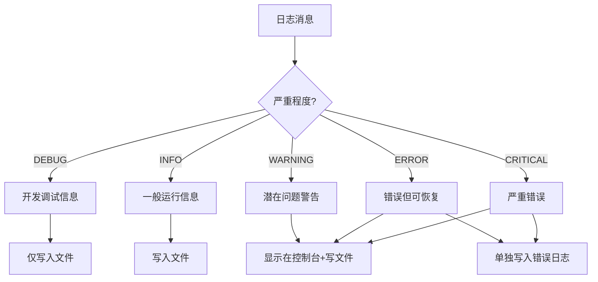
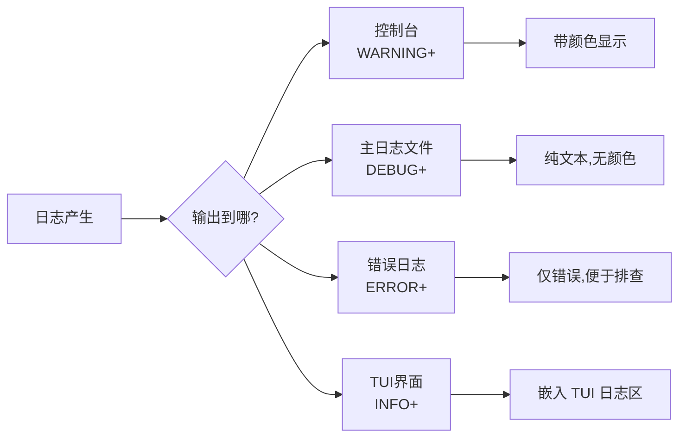
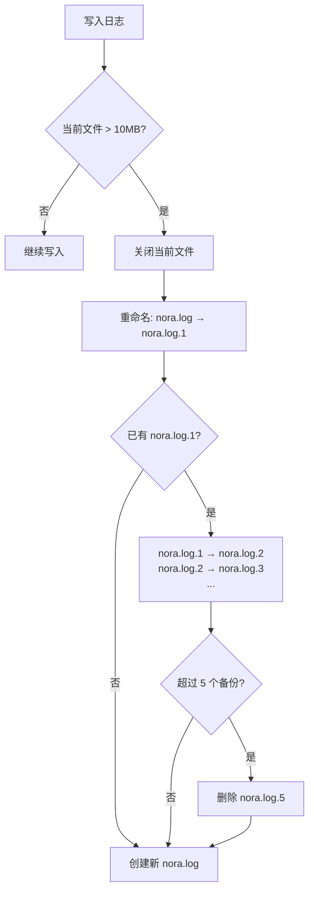
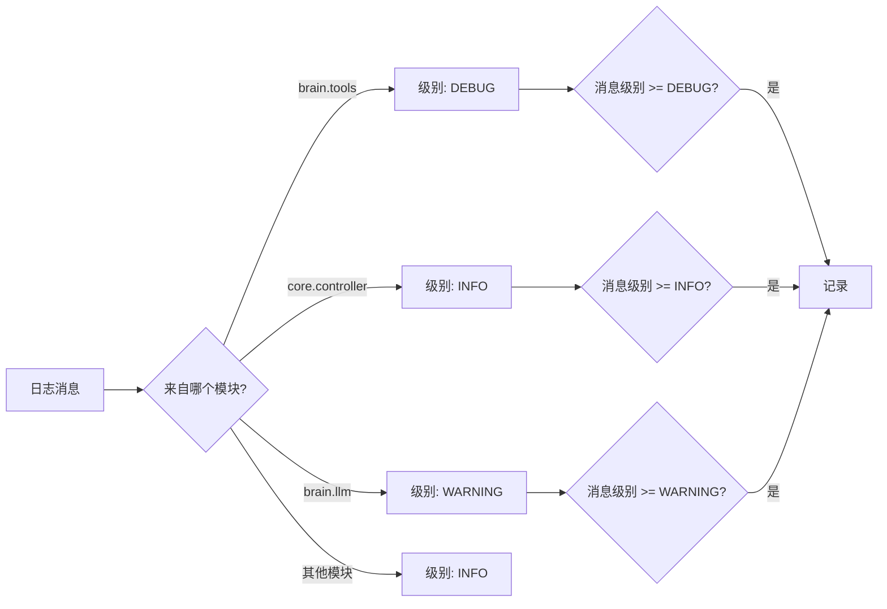
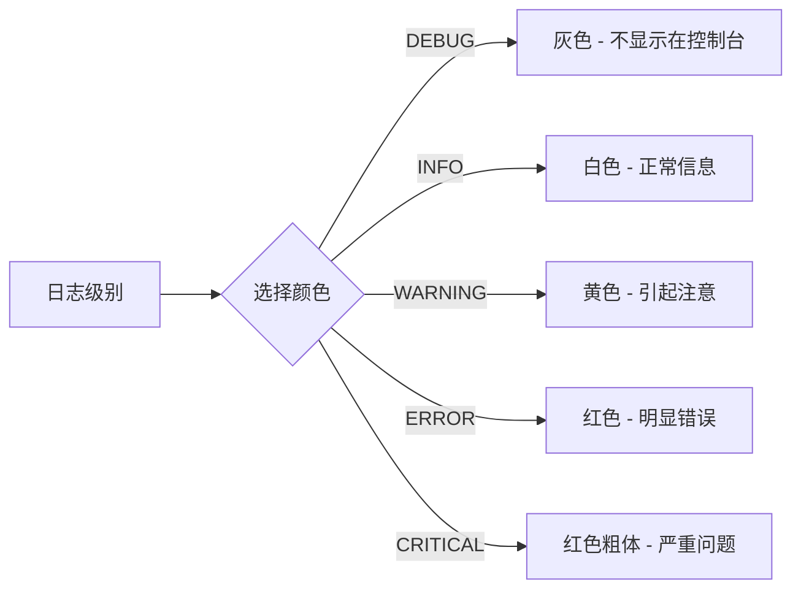
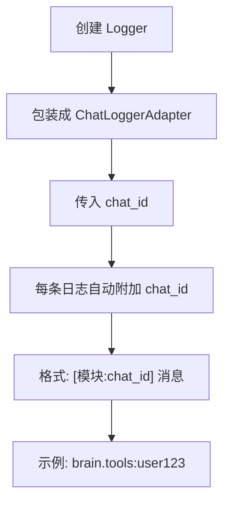
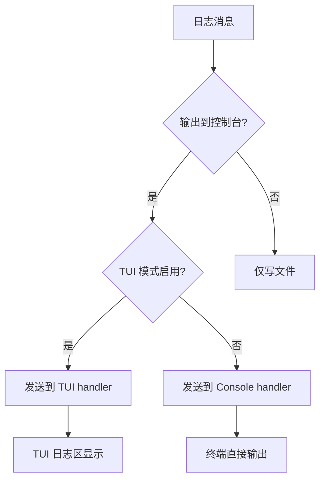

# 日志系统 (Logging System)

## 设计动机

**核心问题**：如何让日志"该详细时详细,该安静时安静"?

真人助手的行为:

- 正常工作时默默干活,不唠叨
- 出问题时详细说明,方便排查
- 重要事情记笔记,事后可查
- 不同场合说话详细程度不同(跟老板 vs 跟同事)

AI 的日志问题(优化前):

- 所有日志混在一起,难以查找
- 开发调试信息泄露给用户
- 无限增长的日志文件占满磁盘
- 每个模块都在喊"我做了XX",信息过载

## 核心设计

### 日志分级策略



### 日志去向



## 日志层次设计

### 层次 1: 控制台 (Console)

**目的**: 用户实时看到的信息

**级别**: WARNING 及以上

**特点**:

- 彩色输出 (ERROR 红色, WARNING 黄色)
- 简洁格式: `[时间] [级别] 消息`
- 不显示模块名 (减少视觉噪音)

**效果**:

```
[14:30:25] [WARNING] Loop detected for write_file:/path/to/file.py
[14:30:30] [ERROR] Skill execution failed: template code detected
```

### 层次 2: 文件日志 (File Log)

**目的**: 开发者事后排查问题

**级别**: DEBUG 及以上

**特点**:

- 详细格式: `[时间] [级别] [模块:聊天ID] 消息`
- 包含所有调试信息
- 自动轮换 (10MB/文件, 保留 5 个备份)

**效果**:

```
2024-01-15 14:30:25,123 - DEBUG - brain.tools:user123 - Checking for template code in skill: reddit_manager
2024-01-15 14:30:25,456 - INFO - core.controller:user123 - Tool call: execute_skill(reddit_manager, {"subreddit":"BA"})
2024-01-15 14:30:25,789 - ERROR - brain.tools:user123 - REFUSED: Skill contains template placeholder
```

### 层次 3: 错误日志 (Error Log)

**目的**: 快速定位错误

**级别**: ERROR 及以上

**特点**:

- 仅记录错误和严重错误
- 格式同文件日志
- 独立文件,不被 DEBUG 信息淹没

**效果**:

```
2024-01-15 14:30:25,789 - ERROR - brain.tools:user123 - REFUSED: Skill contains template placeholder
2024-01-15 14:32:10,234 - CRITICAL - brain.llm:user456 - API request failed: 503 Service Unavailable
```

## 文件轮换机制



**好处**:

- 防止日志文件无限增长
- 保留近期历史 (约 50MB)
- 自动清理老旧日志

**示例**:

```
logs/
  ├── nora.log           (当前日志, 8MB)
  ├── nora.log.1         (昨天的日志, 10MB)
  ├── nora.log.2         (前天的日志, 10MB)
  ├── nora.log.3         (3天前, 10MB)
  ├── nora.log.4         (4天前, 10MB)
  └── nora.log.5         (5天前, 10MB, 即将被删除)
```

## 模块级别控制

### 问题: 不同模块的噪音程度不同

**例子**:

- `brain.tools` - 需要详细调试 (DEBUG)
- `core.controller` - 关键逻辑 (INFO)
- `brain.llm` - API 调用太多 (WARNING)

### 解决方案: 模块级别配置



**效果**:

- 工具调用模块的详细信息会显示
- LLM 模块的常规日志被过滤
- Controller 的重要决策会显示

## 彩色输出设计

### 颜色映射



**ANSI 颜色代码**:

- 灰色: `\033[90m`
- 白色: `\033[0m` (默认)
- 黄色: `\033[33m`
- 红色: `\033[31m`

**好处**:

- 快速识别问题严重程度
- 错误消息一眼就能看到
- 调试信息不打扰 (灰色/不显示)

## 聊天 ID 自动注入

### 问题: 多用户场景下日志混乱

**例子**:

```
[14:30:25] User A: 帮我搜索 XX
[14:30:26] User B: 下载 YY
[14:30:27] Tool call result: ...  ← 这是谁的结果?
```

### 解决方案: ChatLoggerAdapter



**好处**:

- 可以追踪单个用户的对话流程
- 多用户并发时日志不混乱
- 便于事后排查特定用户的问题

## 与 TUI 集成



**TUI 模式特点**:

- 日志嵌入 TUI 界面的日志区
- 不打断用户输入
- 可滚动查看历史日志
- 仍然保持颜色

## 真实案例

### 案例 1: 工具循环检测

**日志输出** (控制台):

```
[14:30:25] [WARNING] Loop detected for write_file:src/main.py, refusing
```

**日志输出** (文件):

```
2024-01-15 14:30:25,123 - DEBUG - core.controller:user123 - Last tool: write_file:src/main.py
2024-01-15 14:30:25,234 - DEBUG - core.controller:user123 - Current tool: write_file:src/main.py
2024-01-15 14:30:25,345 - WARNING - core.controller:user123 - Loop detected, refusing
2024-01-15 14:30:25,456 - INFO - core.controller:user123 - Returning loop warning to LLM
```

**分析价值**:

- 控制台显示警告 (用户知道出问题了)
- 文件显示完整流程 (开发者知道为什么触发)

### 案例 2: 技能执行失败

**日志输出** (控制台):

```
[14:32:10] [ERROR] Skill execution failed: template code detected
```

**日志输出** (文件):

```
2024-01-15 14:32:08,123 - DEBUG - brain.tools:user123 - Executing skill
2024-01-15 14:32:08,234 - DEBUG - brain.tools:user123 - Reading skill file
2024-01-15 14:32:08,345 - DEBUG - brain.tools:user123 - Checking for template markers
2024-01-15 14:32:08,456 - DEBUG - brain.tools:user123 - Found template marker
2024-01-15 14:32:08,567 - ERROR - brain.tools:user123 - REFUSED: template placeholder
2024-01-15 14:32:08,678 - INFO - core.controller:user123 - Tool execution refused
```

**日志输出** (错误日志):

```
2024-01-15 14:32:08,567 - ERROR - brain.tools:user123 - REFUSED: template placeholder
```

**分析价值**:

- 用户看到简洁错误
- 开发者看到详细检测流程
- 错误日志单独记录,便于批量分析

### 案例 3: API 调用过滤

**优化前** (所有 API 调用都记录):

```
[14:35:01] [INFO] Sending API request
[14:35:02] [INFO] Received API response (1234 tokens)
[14:35:05] [INFO] Sending API request
[14:35:06] [INFO] Received API response (2345 tokens)
...  (每次对话 2 条日志)
```

**优化后** (LLM 模块设为 WARNING):

```
(控制台无 API 日志,除非出错)

文件日志仍然记录 (级别 INFO):
2024-01-15 14:35:01 - INFO - brain.llm:user123 - Sending API request
2024-01-15 14:35:02 - INFO - brain.llm:user123 - Received response (1234 tokens)
```

## 设计权衡

| 方面             | 优势                | 劣势            |
| ---------------- | ------------------- | --------------- |
| **分级输出**     | 控制台简洁,文件详细 | 配置复杂度增加  |
| **文件轮换**     | 防止磁盘占满        | 老日志自动删除  |
| **模块级别**     | 精确控制噪音        | 需要维护配置    |
| **彩色输出**     | 快速识别问题        | 终端需支持 ANSI |
| **chat_id 注入** | 多用户可追踪        | 日志行变长      |
