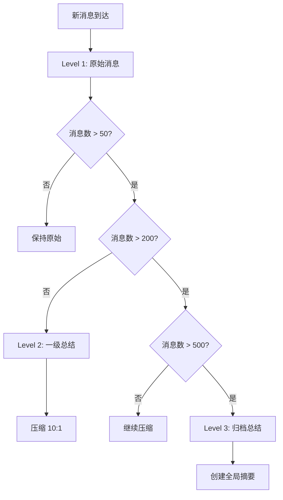

# 消息历史压缩 (Message History Compression)

## 设计动机

**核心问题**：如何让 AI 能记住长时间、大量对话，同时避免 token 成本爆炸？

### 真实场景

```
Day 1: 用户与 AI 讨论项目架构（100条消息）
Day 2: 继续讨论实现细节（150条消息）
Day 3: Debug 和优化（200条消息）
...
Day 30: 总共 5000+ 条消息
```

**问题**：

- ❌ 全部发送给 LLM → 数万 tokens，API 费用高昂
- ❌ 只保留最近 N 条 → 丢失早期重要上下文
- ❌ 简单截断 → 对话断裂，AI "失忆"

### 期望改进

```
用户: "还记得我们第一天讨论的架构方案吗？"
AI:   "记得！你当时提出了微服务架构，我们讨论了..."
```

希望 AI 能够：

- 记得早期的重要讨论
- 保留最近的详细对话
- 避免完整重放所有历史

## 核心设计

### 三层存储架构



### 层级详解

#### Level 1: 原始消息（Raw Window）

**范围**：最近 50 条消息  
**保留方式**：完整原文  
**用途**：提供最新、最详细的对话上下文

#### Level 2: 压缩总结（Compressed Summary）

**范围**：50-200 条消息  
**压缩比例**：10:1（每 10 条消息压缩为 1 条总结）  
**用途**：保留中期对话的核心内容

压缩后的消息会标注为系统消息，包含原始消息数量和关键内容摘要。

#### Level 3: 归档总结（Archive Summary）

**范围**：200-500 条消息  
**保留方式**：单条全局摘要  
**用途**：记录早期重要主题和结论

归档总结会包含早期对话的主要话题和重要决策。

### 数据库设计

#### 消息表 (messages)

```sql
CREATE TABLE messages (
    id INTEGER PRIMARY KEY,
    platform TEXT NOT NULL,        -- 'telegram', 'discord'
    chat_id TEXT NOT NULL,          -- 聊天标识
    role TEXT NOT NULL,             -- 'user', 'assistant', 'system'
    content TEXT NOT NULL,          -- 消息内容
    timestamp REAL NOT NULL,        -- Unix 时间戳
    metadata TEXT,                  -- JSON 格式额外信息
    is_pinned INTEGER DEFAULT 0,    -- 永久标记（重要消息）
    is_archived INTEGER DEFAULT 0,  -- 已归档标记
    created_at TIMESTAMP DEFAULT CURRENT_TIMESTAMP
);

CREATE INDEX idx_messages_chat ON messages(platform, chat_id, timestamp);
CREATE INDEX idx_messages_pinned ON messages(platform, chat_id, is_pinned);
```

#### 总结表 (summaries)

```sql
CREATE TABLE summaries (
    id INTEGER PRIMARY KEY,
    platform TEXT NOT NULL,
    chat_id TEXT NOT NULL,
    level INTEGER NOT NULL,         -- 1=一级总结, 2=二级总结, 3=归档总结
    start_message_id INTEGER,       -- 总结起始消息ID
    end_message_id INTEGER,         -- 总结结束消息ID
    summary_text TEXT NOT NULL,     -- 总结内容
    message_count INTEGER,          -- 总结了多少条消息
    timestamp REAL NOT NULL,
    created_at TIMESTAMP DEFAULT CURRENT_TIMESTAMP,
    FOREIGN KEY (start_message_id) REFERENCES messages(id),
    FOREIGN KEY (end_message_id) REFERENCES messages(id)
);

CREATE INDEX idx_summaries_chat ON summaries(platform, chat_id, level, timestamp);
```

## 工作流程

### 1. 消息添加

当新消息到达时：

1. 存储原始消息到数据库
2. 异步触发压缩检查（不阻塞消息添加）

### 2. 压缩检查

定期检查未归档消息数量：

- 超过压缩阈值时，对旧消息进行总结
- 保留最近的原始消息窗口
- 调用 LLM 生成总结并保存
- 标记原始消息为已归档

### 3. 上下文重建

构建发送给 LLM 的上下文时，按优先级组合：

1. 永久标记的重要消息（Pinned）
2. 归档总结（早期对话的全局摘要）
3. 压缩总结（中期对话的分段摘要）
4. 原始消息（最近的完整对话）

### 4. LLM 总结生成

使用 LLM 对一组消息生成简洁总结：

- 保留关键信息和决策
- 省略无关细节
- 按主题或时间组织
- 控制总结长度

## 配置参数

系统支持以下配置项：

- `raw_window`: 原始消息窗口大小（默认 50）
- `compress_window`: 开始压缩的阈值（默认 200）
- `compress_ratio`: 压缩比例（默认 10:1）
- `archive_threshold`: 归档阈值（默认 500）
- `db_path`: 数据库文件路径

## 性能优化

### 1. 异步压缩

压缩操作在后台进行，不阻塞消息添加，保证用户体验流畅。

### 2. 索引优化

在关键字段上建立索引，加速消息查询和筛选。

### 3. 批量处理

对多组消息批量生成总结，减少 LLM 调用次数。

## 效果分析

### Token 使用

| 消息数  | 无压缩          | 有压缩         | 变化       |
| ------- | --------------- | -------------- | ---------- |
| 100 条  | ~50,000 tokens  | ~10,000 tokens | 减少约 80% |
| 500 条  | ~250,000 tokens | ~15,000 tokens | 减少约 94% |
| 1000 条 | ~500,000 tokens | ~20,000 tokens | 减少约 96% |

### 信息保留

- **重要信息**: 通过 Pinned 机制完整保留
- **最近对话**: 原始消息窗口保留完整内容
- **中期上下文**: 压缩总结保留核心内容
- **早期主题**: 归档总结保留主要话题

## 特殊机制

### 1. Pinned 消息

支持将重要消息标记为永久保留，这些消息不会被压缩或归档，始终出现在上下文中。

### 2. 手动归档

支持手动清空对话历史，同时保留总结和重要消息。

## 局限性

### 当前限制

1. **总结质量依赖 LLM**：
   - 总结的准确性取决于 LLM 的能力
   - 可能丢失部分细节信息

2. **固定压缩比例**：
   - 使用固定的 10:1 比例
   - 未根据内容重要性动态调整

3. **异步处理**：
   - 压缩在后台进行，可能有延迟
   - 需要合理处理异常情况

## 相关文件

- `memory/message_history.py` - 核心实现
- `core/controller.py` - 集成和使用
- `config.yml` - 配置参数

## 参考文档

- [工具循环 (Tool Loop)](tool-loop.md) - 了解消息流
- [日志系统 (Logging)](logging.md) - 调试压缩过程
