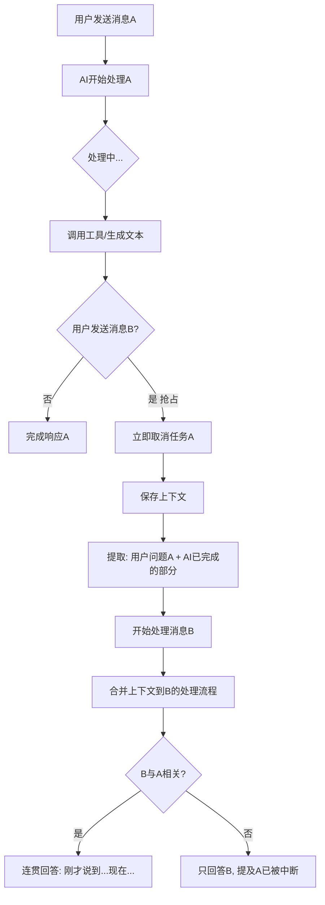

# 消息抢占机制 (Preemption)

## 设计动机

**核心问题**：如何让 AI 像真人一样，能够在思考/说话过程中被打断？

真实对话场景：

- 你问朋友："今天天气怎么样？"
- 朋友正在查天气 App...
- 你突然说："算了，我看手机了"
- 朋友：（放弃查天气）“不是哥们，找茬呢？”

传统 AI 系统：

- 用户：“欸帮我看一下xx的天气”
- AI 开始处理...
- 用户内心OS：哎呀算了算了，我自己看看吧，更详细
- 用户：“算了我自己看”
- AI还在处理........
- 用户：“好吧只能取消了”（点击暂停按钮）
- AI: （欲言又止）

## 核心设计

### 抢占流程图

注意，这是请求llm使用流式传输的基础下



### 上下文保存与合并

**保存内容**：

1. `pending_text` - 用户的原始问题 A
2. `interrupted_thought` - AI 已生成的部分响应（可能只有半句话）

**合并策略**：
将 A 和 B 组合成一个"元提示"：

> "刚才您问了：'{A}'，  
> 我正想回答：'{已完成的部分}'...  
> 但还没说完就被新的消息打断了。
>
> --- 新的消息 ---  
> {B}
>
> 【指令】请将我刚才未说完的思路与现在的新问题结合，给出一个连贯、完整的最终回复。"

## 优势

| 维度           | 传统系统                           | 抢占机制                 |
| -------------- | ---------------------------------- | ------------------------ |
| **响应速度**   | 需等待当前任务完成（10-30秒）      | 可能更快                 |
| **用户体验**   | "人机感"，完完全全就是在跟机器说话 | 流畅，像真人对话         |
| **资源效率**   | 浪费 token 完成无用任务            | 取消无用任务，节省资源   |
| **对话连贯性** | 上下文割裂（处理时不能接受消息）   | 自动合并上下文，保持连贯 |

## 技术实现关键点

### 异步任务管理

- 每个对话会话独立的 `asyncio.Task`
- 新消息到达时 `task.cancel()` 触发取消
- 捕获 `CancelledError` 异常来保存现场

### 状态隔离

- 每个会话独立的 `session` 字典
- 保存 `pending_text` 和 `interrupted_thought`
- 下次处理时检查并合并

### 等待窗口

- 取消任务后 `await asyncio.sleep(0.1)` 确保清理完成
- 避免竞态条件

## 与其他系统对比

| 类型              | 抢占方式          | 上下文处理               | 典型场景        |
| ----------------- | ----------------- | ------------------------ | --------------- |
| **传统问答系统**  | 无，严格队列      | 每轮独立                 | 客服机器人、FAQ |
| **聊天网页应用**  | 手动停止按钮      | 用户主动点击，无自动合并 | 网页版 LLM 服务 |
| **语音助手**      | 唤醒词打断        | 重新开始，丢弃旧任务     | Siri, Alexa     |
| **N.O.R.A. Core** | 自动检测+立即抢占 | 自动保存+智能合并        | 真人式对话      |

## 设计权衡

### 挑战

**提示复杂度增加**

- 需要让 LLM 理解"未完成的思路"与"新问题"的关系
- 可能导致响应变长（要同时处理两个问题）

**边界条件处理**

- 如果 AI 刚开始处理就被打断（`interrupted_thought` 为空）
- 如果连续多次打断（嵌套抢占）

### 解决方案

**智能合并提示**

- 明确告诉 LLM："如果新问题与旧问题无关，可以只回答新问题"
- 提供决策灵活性

**简化处理**

- 只保存最近一次的抢占上下文
- 连续打断时，丢弃更早的未完成任务

## 真实场景示例

### 场景 1：相关问题的连贯回答

```
用户: "帮我搜索一些相关内容"
AI: (开始执行搜索任务...)
     (已找到部分结果...)
用户: "需要过滤一下条件"  ← 抢占
AI: "好的！刚才您让我搜索内容，我已经找到一些结果，
     现在根据您的要求调整筛选条件。正在重新搜索..."
```

### 场景 2：无关问题的切换

```
用户: "分析一下这段代码的性能问题..."
AI: (正在读文件、分析...)
用户: "算了，先告诉我今天天气" ← 抢占
AI: "好的，已中断代码分析。正在为您查询天气..."
```

## 未来优化方向

1. **智能取消决策** - 如果任务已完成 90%，可能不取消反而更高效
2. **增量交付** - 支持 `[SPLIT]` 标签，已完成的部分先发送，减少浪费
3. **优先级队列** - 支持不同优先级（如 /stop 命令最高优先级）
4. **抢占历史** - 记录抢占日志，供调试和优化
