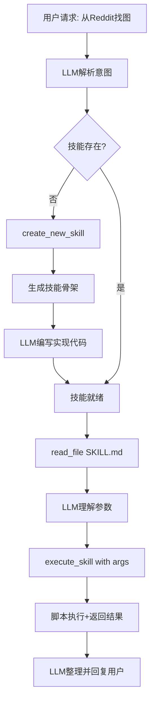
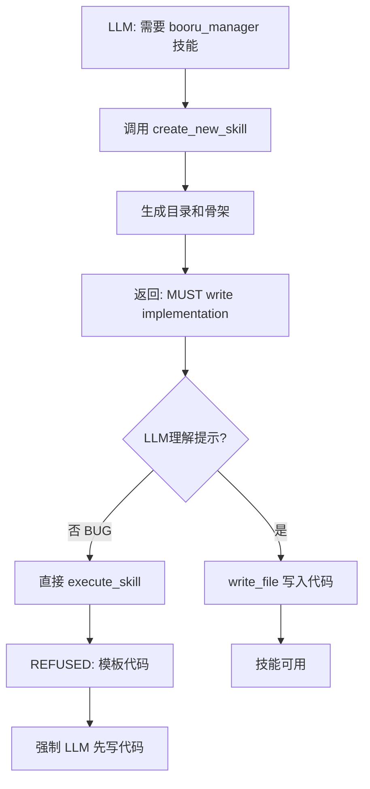
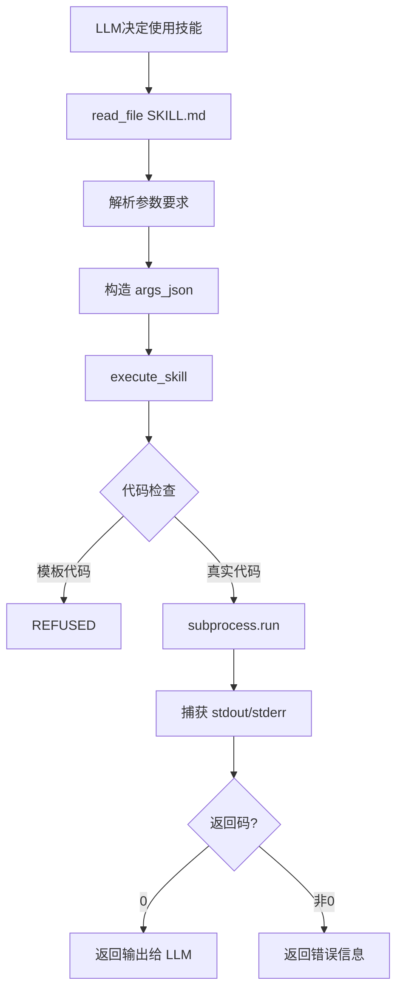

# 技能系统 (Skills)

## 设计动机

**核心问题**：如何让 AI 像真人一样，不仅能聊天，还能"做事"？

真人对话：

- "帮我查一下明天的天气" → 打开天气 App 查询
- "从 Reddit 下载几张图" → 打开浏览器、搜索、保存
- "分析这段代码" → 打开编辑器、阅读、思考

AI 需要：

- 调用外部 API（天气、搜索引擎、社交媒体）
- 执行脚本（爬虫、图像处理、数据分析）
- 操作文件系统（读写文件、管理下载）

**传统方案的问题**：

- 硬编码每个功能 → 不可扩展
- LLM 直接写代码执行 → 不安全
- 使用通用 `exec_command` → 容易出错，无规范

## 核心设计

### 技能架构



### 技能结构

每个技能是一个独立目录：

```
skills/
  ├── reddit_manager/
  │   ├── SKILL.md          # 技能文档（参数、用法）
  │   ├── main.py           # 实现代码
  │   └── __init__.py
  ├── pixiv_manager/
  └── weather_api/
```

**SKILL.md** - 技能的"说明书"：

- 技能名称和描述
- 参数列表（必填/可选）
- 使用示例
- LLM **必须先读这个文档**才能正确调用

**main.py** - 技能的实现：

- 使用 `argparse` 解析命令行参数
- 实现具体功能逻辑
- 输出结果到 stdout（JSON 或文本）
- 有 `if __name__ == "__main__"` 入口点

## 工作流程

### 1. 技能发现


### 2. 技能创建

当 LLM 发现需要新能力时：



### 3. 技能执行



## 设计优势

| 维度         | 优势                                                    |
| ------------ | ------------------------------------------------------- |
| **安全性**   | 技能代码在隔离的 subprocess 中运行，有超时限制（120秒） |
| **规范性**   | 所有技能必须遵循统一接口（argparse + stdout）           |
| **可扩展**   | 添加新技能只需在 `skills/` 创建目录，无需修改核心代码   |
| **可调试**   | SKILL.md 文档化，LLM 行为可追踪                         |
| **LLM 友好** | 先读文档再调用，避免盲目猜测参数                        |

## 与工具系统的区别

### 基础工具 (Tools)

- 内置能力：`read_file`, `write_file`, `list_dir`, `exec_command`
- 直接调用，无需学习
- 适用场景：文件操作、简单命令

### 高级技能 (Skills)

- 外部能力：`reddit_manager`, `pixiv_manager`
- 需要先读文档（`SKILL.md`）
- 适用场景：复杂业务逻辑、外部 API 集成

**提示中的区分**：

> "基础工具是你的双手，直接用；高级技能是后天学习的知识，必须先读文档。"

## 防护机制

### 1. 模板代码检测

**问题**：LLM 创建技能后不写实现代码，直接执行空壳

**解决方案**：

- `create_new_skill` 返回强提示："MUST write code first"
- `execute_skill` 执行前检查代码内容
- 发现 `TODO: Replace this placeholder` → 直接拒绝：`REFUSED: template code`

### 2. 循环执行拦截

**问题**：LLM 执行技能无输出，重复执行

**解决方案**：

- 循环检测器：`execute_skill:skill_name` 连续 5 次 → 强制中断
- 错误信息不算"有意义输出"，避免泄露给用户

### 3. 超时保护

- 每个技能最长运行 120 秒
- 超时后强制终止，返回 `TimeoutError`

## 真实场景示例

### 场景：内容搜索与下载

```
用户: "搜索并下载一些图片"

LLM 思考过程:
1. 检查技能列表 → 找到对应的管理技能
2. read_file('skills/xxx_manager/SKILL.md')
3. 理解参数: --keyword, --limit, --filter
4. 构造调用: execute_skill("xxx_manager",
              '{"keyword": "...", "limit": "5", "filter": "safe"}')
5. 脚本执行 → 下载内容到 downloads/ 目录
6. 返回结果: "Downloaded 5 items: [路径列表]"
7. LLM 整理: "已为您找到并下载了 5 个项目：[路径列表]..."
```
