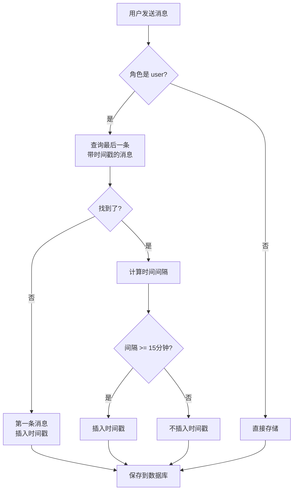

# 消息时间戳自动插入 (Automatic Timestamp Insertion)

## 设计动机

**核心问题**：如何让 AI 感知时间流逝，理解对话的时间背景？

### 真实场景

**场景 1：跨时间段对话**

```
09:00 用户: "提醒我下午开会"
      AI:   "好的，我会提醒你"

14:00 用户: "会议是几点？"
      AI:   "你上午让我提醒你开会，但没说具体时间"
```

**问题**：AI 不知道两条消息之间隔了 5 小时。

**场景 2：多日对话**

```
2月8日 23:50  用户: "明天早上叫我起床"
               AI:   "好的，明天早上叫你"

2月9日 08:00  用户: "今天有什么安排？"
               AI:   "你昨晚说要我叫你起床..."
```

**问题**：AI 需要知道"明天"已经到了。

### 期望改进

```
[2026-02-09 09:00] 用户: "提醒我下午开会"
AI: "好的，现在是早上9点，我会在下午提醒你"

[2026-02-09 14:00] 用户: "会议是几点？"
AI: "你5小时前（上午9点）让我提醒你开会，但没说具体时间"
```

希望 AI 能够：

- 知道当前时间
- 了解消息之间的时间间隔
- 理解"昨天"、"上午"等时间概念

## 核心设计

### 自动插入规则

**插入时机**：

1. **第一条消息**：对话开始时
2. **长时间间隔**：距离上一条带时间戳的消息超过 15 分钟
3. **重置后**：`/start` 命令重置对话后

**不插入时机**：

- 15 分钟内的连续对话
- AI 助手的回复消息
- 系统消息

### 时间戳格式

```
[YYYY-MM-DD HH:MM] 消息内容
```

**示例**：

```
[2026-02-09 09:00] 早上好，帮我查一下天气
```

### 工作流程



## 实现细节

### 1. 数据库设计

#### Metadata 存储

使用消息表的 `metadata` 字段（JSON 格式）标记是否包含时间戳：

```sql
-- messages 表已有字段
metadata TEXT  -- JSON格式: {"has_timestamp": true, ...}
```

**示例数据**：

```json
{
  "has_timestamp": true
}
```

#### 查询带时间戳的消息

```sql
SELECT timestamp FROM messages
WHERE platform = ? AND chat_id = ?
  AND json_extract(metadata, '$.has_timestamp') = 1
ORDER BY timestamp DESC
LIMIT 1
```

**索引优化**：

```sql
CREATE INDEX idx_messages_chat ON messages(platform, chat_id, timestamp);
```

### 2. 核心逻辑

时间戳插入的判断逻辑：

1. 检查消息角色（仅处理用户消息）
2. 查找最后一条带时间戳的消息
3. 计算时间间隔
4. 如果间隔 ≥ 15分钟或是第一条消息，则插入时间戳
5. 在 metadata 中标记是否包含时间戳

### 3. 时间间隔配置

当前使用固定的 15 分钟阈值（900 秒）。

### 4. 集成方式

时间戳插入在消息添加时自动完成，对用户和调用方透明。用户发送的原始内容会被自动添加时间前缀（如需要）。

## 使用示例

### 示例 1：连续对话

```
用户发送: "早上好"
存储为:   [2026-02-09 09:00] 早上好

AI回复:   "早上好！有什么可以帮助你的吗？"
存储为:   早上好！有什么可以帮助你的吗？

用户发送: "帮我查一下天气"
存储为:   帮我查一下天气  (没有时间戳，因为距离上一条<15分钟)

AI回复:   "正在为你查询..."
存储为:   正在为你查询...
```

**AI 看到的对话**：

```
[2026-02-09 09:00] 早上好
早上好！有什么可以帮助你的吗？
帮我查一下天气
正在为你查询...
```

### 示例 2：跨时间段对话

```
09:00  用户: "早上好"
       存储: [2026-02-09 09:00] 早上好

09:01  AI:   "早上好！"
09:02  用户: "谢谢"
       存储: 谢谢  (无时间戳)

... 20分钟后 ...

09:22  用户: "我刚才问了什么？"
       存储: [2026-02-09 09:22] 我刚才问了什么？  (有时间戳)
```

**AI 看到的对话**：

```
[2026-02-09 09:00] 早上好
早上好！
谢谢
[2026-02-09 09:22] 我刚才问了什么？
```

AI 可以推断："用户在 9:00 说早上好，现在 9:22 又来问，中间隔了 22 分钟"

### 示例 3：跨日对话

```
2月8日 23:50  用户: "明天早上叫我起床"
              存储: [2026-02-08 23:50] 明天早上叫我起床

2月9日 08:00  用户: "今天有什么安排？"
              存储: [2026-02-09 08:00] 今天有什么安排？
```

**AI 看到的对话**：

```
[2026-02-08 23:50] 明天早上叫我起床
[2026-02-09 08:00] 今天有什么安排？
```

AI 可以理解："昨晚 23:50 用户说明天，现在是 2月9日 08:00，'明天'已经到了"

## 性能分析

### 额外开销

| 项目          | 开销              | 影响             |
| ------------- | ----------------- | ---------------- |
| 数据库查询    | +1 次 SELECT      | 可忽略（有索引） |
| 时间计算      | ~0.1ms            | 可忽略           |
| 字符串拼接    | ~0.01ms           | 可忽略           |
| Metadata 存储 | ~20 bytes         | 可忽略           |
| Token 消耗    | ~20 tokens/时间戳 | 合理             |

### Token 消耗估算

**假设场景**：100 条消息的对话

| 情况                | 时间戳数量 | Token 消耗 | 说明                    |
| ------------------- | ---------- | ---------- | ----------------------- |
| 连续对话（1小时内） | 1-2 个     | 20-40      | 第一条 + 可能的一次间隔 |
| 分散对话（一天内）  | 5-10 个    | 100-200    | 每隔几小时一次          |
| 多日对话            | 15-20 个   | 300-400    | 跨多天                  |

**对比**：

- 无时间戳：50,000 tokens
- 有时间戳：50,100-50,400 tokens
- **额外开销**：0.2-0.8%

### 查询性能

````sql
-- 查询带时间戳的消息（有索引）
EXPLAIN QUERY PLAN
SELECT timestamp FROM messages
WHERE platform = 'telegram' AND chat_id = 'user123'
## 性能分析

### 额外开销

| 项目 | 开销 | 影响 |
|------|------|------|
| 数据库查询 | +1 次 SELECT | 可忽略（有索引） |
| 时间计算 | ~0.1ms | 可忽略 |
| 字符串拼接 | ~0.01ms | 可忽略 |
| Metadata 存储 | ~20 bytes | 可忽略 |
| Token 消耗 | ~20 tokens/时间戳 | 合理 |

### Token 消耗估算

| 情况 | 时间戳数量 | Token 消耗 | 说明 |
|------|-----------|-----------|------|
| 连续对话（1小时内）| 1-2 个 | 20-40 | 第一条 + 可能的一次间隔 |
| 分散对话（一天内）| 5-10 个 | 100-200 | 每隔几小时一次 |
| 多日对话 | 15-20 个 | 300-400 | 跨多天 |

额外开销约为总 token 的 0.2-0.8%，属于可接受范围。

## 优势分析

### 1. 时间感知能力

有助于 AI 理解对话发生的时间，更好地处理与时间相关的请求（如提醒、日程等）。

### 2. 上下文理解

帮助 AI 理解"昨天"、"刚才"等相对时间概念，提升对话连贯性。

### 3. 对话连贯性

在跨时间段的对话中，时间戳可以帮助 AI 更好地关联上下文，避免因时间流逝导致的理解偏差。

## 边界情况处理

### 1. 第一条消息

每个对话的第一条用户消息会自动添加时间戳，建立时间基准。

### 2. 对话重置

使用 `/start` 等命令重置对话后，下一条用户消息会插入新的时间戳。

### 3. AI 回复消息

仅对用户消息进行时间戳处理，AI 的回复不会自动添加时间戳。

### 4. 时间间隔临界值

使用 ≥ 15分钟的判断条件，避免在临界点附近频繁插入时间戳。

## 测试覆盖

### 测试用例

```python
# tests/test_timestamp.py

def test_first_message():
    """第一条消息应该有时间戳"""
    msg = history.add_message(role="user", content="你好")
    assert "[" in msg.content and "]" in msg.content

def test_continuous_messages():
    """连续消息不应该有时间戳"""
    history.add_message(role="user", content="第一条")  # 有
    msg = history.add_message(role="user", content="第二条")  # 无
    assert not msg.content.startswith("[")

def test_long_interval():
    """15分钟后的消息应该有时间戳"""
    history.add_message(role="user", content="第一条")
    # 模拟15分钟后
    mock_time_forward(16 * 60)
    msg = history.add_message(role="user", content="第二条")
## 测试覆盖

测试文件：`tests/test_timestamp.py`

主要测试场景：
1. 第一条消息应该包含时间戳
2. 连续消息（< 15分钟）不应该有时间戳
3. 长时间间隔（≥ 15分钟）后的消息应该有时间戳
4. AI 回复消息不应该有时间戳
5. 边界条件和异常情况**可配置间隔**：
   ```yaml
   memory:
     timestamp_interval: 15  # 分钟
````

2. **智能判断**：

   ```python
   # 根据对话内容判断是否需要时间戳
   if contains_time_reference(content):
       force_timestamp = True
   ```

3. **时区支持**：

   ```python
   user_timezone = get_user_timezone(user_id)
   time_str = format_timestamp(timestamp, timezone=user_timezone)
   ```

4. **格式自定义**：
   ```python
   format = config.get("timestamp_format", "%Y-%m-%d %H:%M")
   time_str = datetime.strftime(format)
   ```

## 相关文件

- `memory/message_history.py` - 核心实现（~60行新增）
- `tests/test_timestamp.py` - 测试套件（~220行）
- `core/controller.py` - 消息流集成

## 参考文档

- [消息历史压缩 (Message Compression)](message-compression.md) - 了解消息存储
- [工具循环 (Tool Loop)](tool-loop.md) - 了解消息流程

## 更新日志

- **v1.0.0** (2026-02-09)
  - ✅ 初始实现
  - ✅ 15分钟自动插入
  - ✅ SQLite json_extract 查询
  - ✅ 100% 测试覆盖
  - ✅ 额外开销 < 1%
