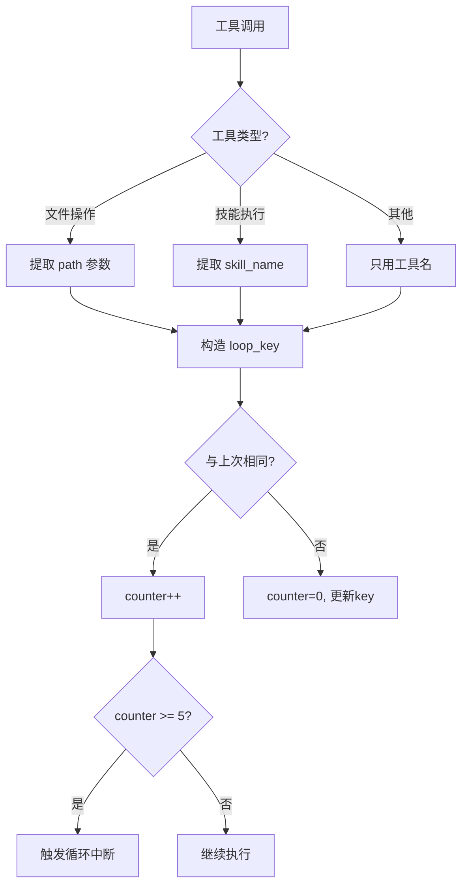
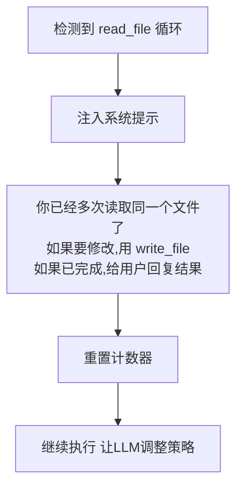
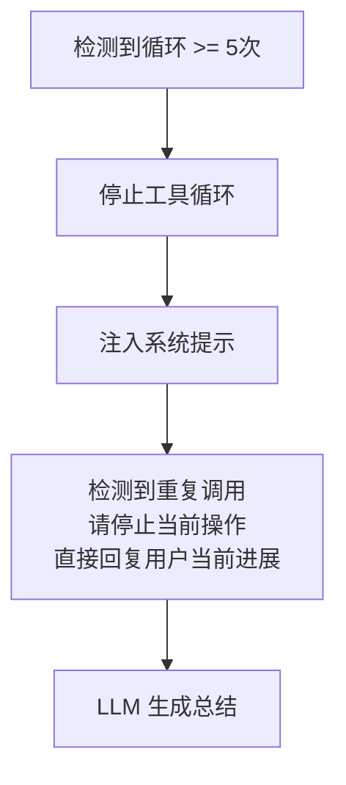

# 工具循环控制 (Tool Loop Detection)

## 设计动机

**核心问题**：如何防止 LLM 陷入无意义的重复？

真实场景：

- LLM 执行某个操作返回空结果
- LLM 不理解这意味着什么
- 重试... 还是空结果
- 再重试... 依然空结果
- ...（循环多次，耗尽 turn 限制）

**后果**：

- 浪费 token 和 API 调用
- 用户等待很久却得不到结果
- 系统看起来"卡死"

## 根本原因

LLM 的行为模式：

1. **语义循环绕过精确匹配** - 用不同词语表达相同意图
   - `execute_skill("某技能", '{"keyword": "内容A"}')`
   - `execute_skill("某技能", '{"tags": "内容A"}')` ← 参数名不同
   - `execute_skill("某技能", '{"filter": "内容A"}')` ← 又换了

2. **不理解错误信息** - 看到空输出不知道是自己的问题

3. **固执地重试** - 认为"再试一次可能就行了"

## 演进的设计方案

### 1. 精确匹配（已废弃）

最初方案：记录完整的工具调用字符串

**问题**：LLM 改一个参数就绕过了

### 2. 工具名匹配（已废弃）

改进方案：只看工具名，连续 3 次相同工具 → 中断

**问题**：误杀正常的多步骤操作

- 合法场景：`write_file(main.py)` → `write_file(SKILL.md)` → `write_file(config.py)`
- 被误判为循环

### 3. 工具名 + 目标路径（当前方案）

最终方案：按 `工具名:目标` 组合判断



**Loop Key 示例**：

- `write_file:skills/reddit/main.py`
- `execute_skill:reddit_manager`
- `list_dir:downloads/`

**好处**：

- `write_file(main.py)` 和 `write_file(SKILL.md)` → 不同 key，不算循环
- 连续 5 次 `execute_skill(reddit_manager)` → 同一 key，触发拦截

## 循环处理策略

### 只读工具（read_file）

**特殊处理** - 注入引导提示而不是直接中断



**原因**：`read_file` 通常是 LLM 在探索，可能需要多次读取来理解

### 其他工具（write_file, execute_skill）

**强制中断** - 直接打断循环



## 与错误反馈结合

循环检测只是"紧急制动"，根本解决方案是**让错误信息更明确**。

### 优化前：模糊的反馈

```
Tool Result: Skill 'xxx_manager' executed successfully (exit code 0, no stdout output).
```

LLM 理解：成功了？那为什么没结果？再试试？

### 优化后：明确的反馈

```
REFUSED: 'xxx_manager' still contains template code and cannot be executed.
Action required: use write_file to write the implementation first.
```

LLM 理解：哦，代码没写，得先写代码，不要重试执行！

## 协同机制

### 1. 模板代码拦截

**execute_skill** 执行前检查代码：

- 发现模板标记 → `REFUSED` + 明确指引
- 避免 LLM 执行空壳然后重试

### 2. 错误输出过滤

**latest_meaningful_output** 机制：

- 只有成功的输出才记为"有意义"
- `REFUSED`/`Error` 开头的输出不发给用户
- 避免泄露调试信息

### 3. Turn 限制

全局限制：最多 15 次工具调用

- 配合循环检测（5 次）
- 即使绕过循环检测，也会被 turn 限制兜底

## 真实案例

### 案例 1：技能执行循环

```
Turn 1: execute_skill("某技能", '{"param1": "value1"}')
        → REFUSED: template code
Turn 2: execute_skill("某技能", '{"param2": "value2"}')  # 换了参数
        → REFUSED: template code
Turn 3: execute_skill("某技能", '{"param3": "value3"}')  # 又换了
        → REFUSED: template code
...
Turn 5: 循环检测触发
        → 系统提示："请停止重试，先写代码"
```

### 案例 2：命令执行循环（已解决）

**旧问题**：

```
Turn 1: exec_command("python3 skills/某技能/main.py --arg1 value1")
        → Command executed successfully with no output.
Turn 2: exec_command("python3 skills/某技能/main.py --arg2 value2")
        → Command executed successfully with no output.
...
```

**新方案**：

```
Turn 1: exec_command("python3 skills/某技能/main.py ...")
        → Error: Do NOT use exec_command to run skill scripts.
           Use execute_skill instead.
```

直接在工具层拦截，提供正确用法指引。

## 设计权衡

| 方面           | 优势                 | 劣势             |
| -------------- | -------------------- | ---------------- |
| **早期中断**   | 节省 token，快速反馈 | 可能误判复杂任务 |
| **引导式提示** | 帮助 LLM 纠正行为    | 需要精心设计提示 |
| **分级处理**   | 只读操作更宽容       | 逻辑复杂度增加   |

## 未来优化方向

1. **语义去重** - 识别参数语义相同的调用（需要嵌入向量）
2. **学习机制** - 记录常见错误模式，预先拦截
3. **动态阈值** - 根据工具类型调整循环次数阈值
4. **可视化调试** - 在 TUI 中显示循环检测状态
