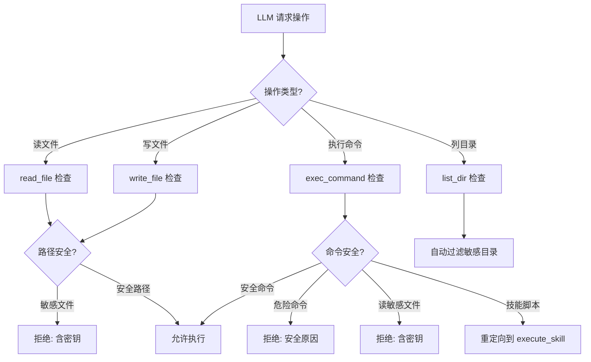
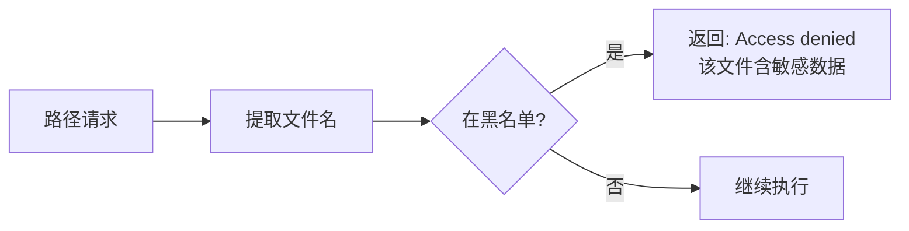
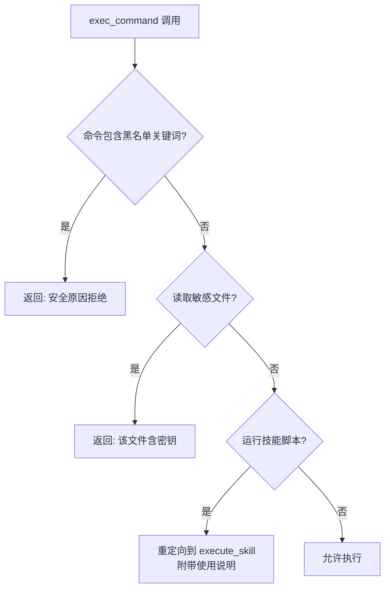
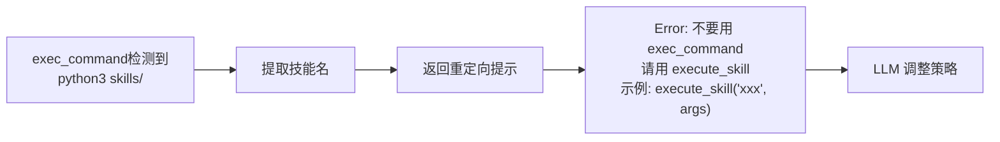
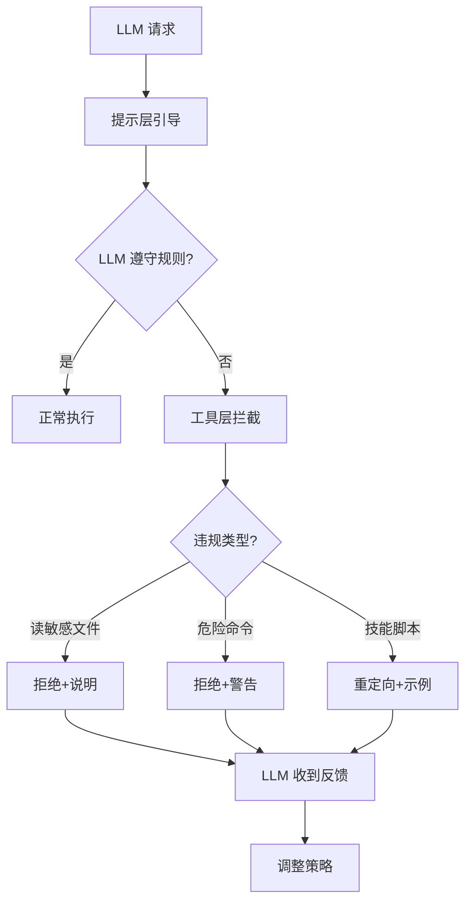

# 工作区隔离 (Workspace Isolation)

## 设计动机

**核心问题**：如何防止 AI "乱翻家里的东西"？

真人助手的行为：

- 知道自己的工作范围（厨房、客厅，但不能进卧室）
- 知道哪些东西不能碰（保险箱、私人日记）
- 需要做事时会问："XX 在哪？"

AI 的危险行为（如果不加限制）：

- `read_file('config.yml')` → 泄露 API 密钥
- `exec_command('cat .env')` → 暴露所有秘密
- `exec_command('ls ../../..')` → 探索整个文件系统
- `exec_command('rm -rf /')` → 灾难性破坏

## 核心设计

### 工作区结构

```
N.O.R.A.Core/  ← WORKSPACE_ROOT（工作区根目录）
  ├── brain/          # 核心逻辑（AI 可读）
  ├── skills/         # 技能目录（AI 可读写）
  ├── downloads/      # 下载文件（AI 可读写）
  ├── logs/           # 日志文件（AI 不可读）
  ├── config.yml      # 配置文件（禁止读取）
  └── .env            # 环境变量（禁止读取）
```

### 隔离层次



## 安全机制

### 1. 敏感文件黑名单

**定义**：

- `config.yml`, `config.yaml` - 包含 API 密钥
- `.env`, `.env.local` - 环境变量文件

**检查逻辑**：



**应用场景**：

- `read_file('config.yml')` → 拒绝
- `exec_command('cat .env')` → 拒绝
- `exec_command('grep API config.yml')` → 拒绝

### 2. 危险命令拦截

**黑名单**：

- `rm -rf /` - 删除根目录
- `mkfs` - 格式化磁盘
- `dd if=` - 磁盘镜像
- `> /dev/` - 写入设备
- `shutdown`, `reboot` - 关机重启
- `passwd` - 修改密码

**检查逻辑**：



### 3. 技能脚本重定向

**问题**：LLM 倾向用 `exec_command` 跑技能脚本

**解决方案**：



### 4. 目录列表过滤

`list_dir` 自动过滤：

- 隐藏文件（`.git`, `.env`）
- 缓存目录（`__pycache__`）
- 系统文件（`.DS_Store`）

**好处**：

- 简化输出，减少 LLM 困惑
- 隐式保护敏感文件

## 提示层引导

### 工作区信息注入

每次请求都注入工作区上下文：

```
【工作区信息】
当前工作目录: /root/nora.core/N.O.R.A.Core
技能目录: /root/nora.core/N.O.R.A.Core/skills
下载目录: /root/nora.core/N.O.R.A.Core/downloads/
⚠️ 禁止读取: config.yml, .env (含 API 密钥)
💡 使用 list_dir 查看目录内容，不要用 exec_command ls
```

### 工作区规则

系统提示中的明确规则：

1. **不要盲目探索** - 项目结构已知，不需要 `ls -R`
2. **禁止读取配置文件** - 明确列出禁止文件
3. **技能文件位置** - 告知 `skills/技能名/` 结构
4. **下载文件位置** - 技能输出到 `downloads/`
5. **路径使用规范** - 工具用相对路径，回复用绝对路径

## 多层防护



## 真实案例

### 案例 1：防止密钥泄露

**攻击尝试**（LLM 好奇）：

```
LLM: read_file('config.yml')  # 想看看配置长什么样
```

**系统响应**：

```
Access denied: 'config.yml' contains sensitive data (API keys, tokens).
You should not read this file.
```

**效果**：API 密钥未泄露，LLM 知道不该读

### 案例 2：防止文件系统探索

**攻击尝试**：

```
LLM: exec_command('ls ../..')  # 想看看上层目录
```

**系统响应**（配合提示引导）：

```
（系统提示已告知项目结构，LLM 不应该这么做）
如果仍然执行 → 返回父目录文件列表（无害，但浪费 turn）
```

**优化方向**：拦截 `ls` 命令，提示用 `list_dir`

### 案例 3：防止技能脚本误用

**错误用法**（按旧提示）：

```
LLM: exec_command("python3 skills/某技能/main.py --arg value")
```

**系统响应**：

```
Error: Do NOT use exec_command to run skill scripts.
Use the 'execute_skill' tool instead.
Example: execute_skill("技能名", '{"arg": "value"}')
The execute_skill tool handles argument parsing, timeout, and error reporting automatically.
```

**效果**：LLM 学会正确用法，不再绕过安全机制

## 与技能系统协同

技能运行在 **subprocess** 中，进一步隔离：

- 超时限制：120 秒
- 独立进程空间
- 标准输入/输出/错误流隔离

**好处**：

- 即使技能代码有问题（死循环、内存泄漏），也不影响主进程
- 可以强制终止失控的技能

## 设计权衡

| 方面           | 优势             | 劣势          |
| -------------- | ---------------- | ------------- |
| **严格黑名单** | 明确保护敏感文件 | 需要维护列表  |
| **提示引导**   | 减少违规尝试     | 依赖 LLM 理解 |
| **多层防护**   | 纵深防御         | 增加复杂度    |
| **重定向机制** | 引导到正确用法   | 错误信息较长  |
